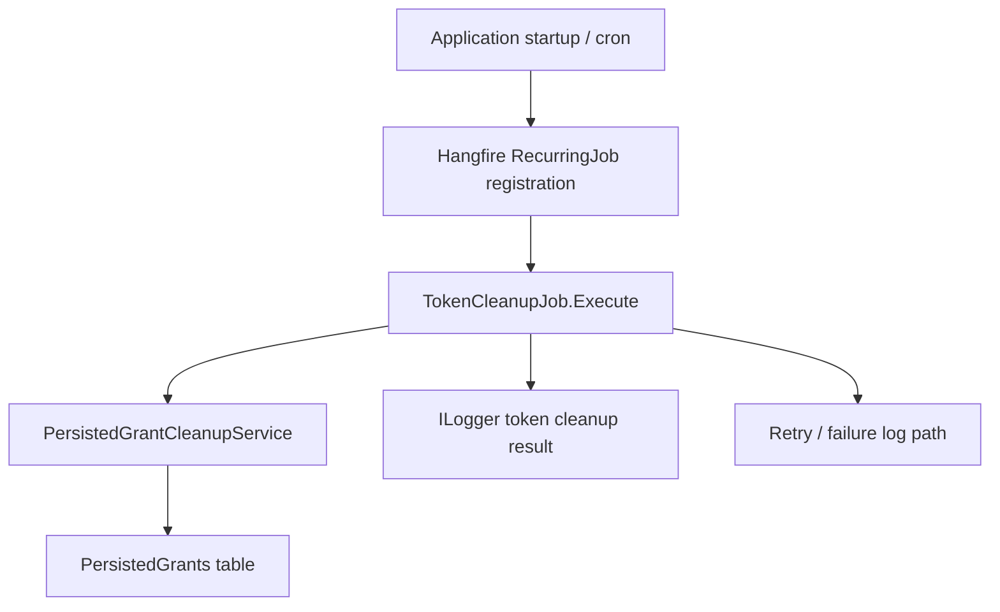
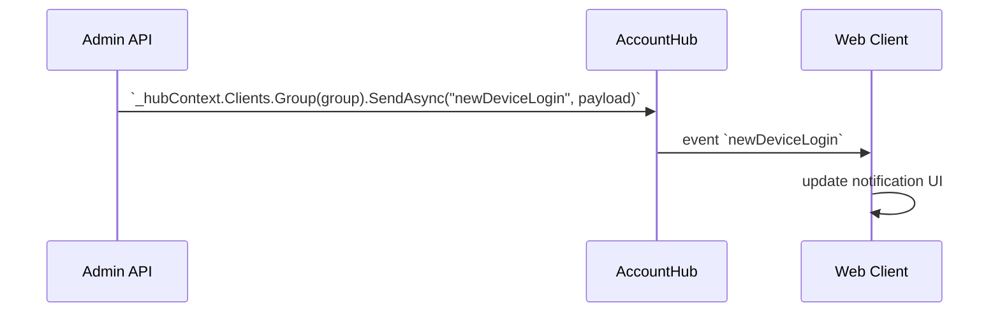

<!-- generated-by: ai-agent-adapter-sync -->


# Source Code Handover (Evidence-First Documentation Pipeline)

## REQUIRED BACKGROUND
Read `.ai/skills/using-superpowers/SKILL.md` before using this skill.

## Language Policy

### AI Execution Language

All instructions intended for AI agents, coordinators, reviewers, validators, workflows, rules, schemas, artifact contracts, validation reports, and script output messages MUST be written in English.

This includes:
- Skill instructions.
- Workflow phases.
- Agent prompts.
- Rules and quality gates.
- Artifact schemas.
- YAML front matter field names.
- Validation scripts.
- Status labels.
- Error messages.
- Review checklists.
- Coverage reports.
- Provenance scan reports.
- Negative-evidence reports.

Intermediate findings, reviews, inventories, `STATUS.md`, validation reports, and all canonical machine-readable artifacts are English. English intermediate artifacts are not a substitute for Vietnamese final docs.

### Final Documentation Language

All final documentation generated in `.ai/runs/source-code-handover/<run_id>/final/` and published to `docs/` for project developers MUST be written in Vietnamese.

This includes:
- Markdown headings.
- Explanations.
- Tables.
- Diagram labels where natural language is used.
- Risks.
- Open questions.
- Limitations.
- Runbooks.
- Troubleshooting guidance.
- Operational procedures.

The following items MUST remain unchanged and may remain in English:
- Source paths.
- File names.
- Class names.
- Method names.
- Namespace names.
- API routes.
- HTTP methods.
- Configuration keys.
- Environment variable names.
- JSON property names.
- Database table and column names.
- Evidence IDs.
- Commands.
- Code blocks.
- Stack traces.
- Framework/library names.
- Mermaid syntax keywords.

Agent 9 is responsible for Vietnamese final-document generation. Agent 10 validates both content quality and language compliance before publish.

## Antigravity Model Policy

When this skill runs in Google Antigravity, route all model work through Gemini models only.

- Do not use `Claude Opus 4.6 Thinking`.
- Do not use `Claude Sonnet 4.6 Thinking`.
- Use deterministic tools and evidence-store artifacts before model reasoning.
- Use `Gemini 3.5 Flash (Low)` only for low-risk inventory classification, formatting, and checklist normalization.
- Use `Gemini 3.5 Flash (Medium)` for cost-sensitive discovery and normal Agent 1/4 findings.
- Use `Gemini 3.5 Flash (High)` for Agents 2, 3, 5, 6, 7, 8, 9, and 10, and for high-risk auth/API/database/Redis/job/migration reasoning.
- Use `Gemini 3.1 Pro (High)` only as a Gemini-family fallback for complex review or synthesis when `Gemini 3.5 Flash (High)` is unavailable or underperforms.
- Do not use `Gemini 3.1 Pro (Low)` for final synthesis, final validation, or high-risk evidence review on non-trivial repositories.

## TOOL ORCHESTRATION POLICY

### Purpose

This skill MUST NOT rely on loading the full repository into model context. The workflow must use indexing, search, semantic analysis, database metadata extraction, runtime artifacts, and evidence manifests to retrieve only the smallest relevant source slice required for each documentation claim.

The pipeline is intentionally split into two levels:

1. **Agent 1-5 broad physical discovery**: each agent runs in its own isolated session and scans the real project files to produce broad, structured inventories. These agents MUST prioritize completeness of discovered components over deep proof. They MUST record the commands, source roots, inventory counts, file paths, symbols, routes, tables, keys, jobs, configs, and unresolved gaps they physically observed. They MUST NOT turn shallow observations into final `[CONFIRMED]` behavior claims.
2. **Agent 6-8 triangulated verification**: Agent 6, Agent 7, and Agent 8 verify different evidence layers. Agent 6 verifies claims at source/symbol level. Agent 7 traces cross-layer flows and finds cross-domain conflicts. Agent 8 creates build/test/runtime/ops/safety evidence. These three agents triangulate the evidence before documentation.
3. **Agent 9 documentation**: Agent 9 writes Vietnamese final docs from triangulated evidence only.
4. **Agent 10 independent validation**: Agent 10 audits final docs independently before publish.

The required evidence flow is:

```text
Agent 1-5 discovery candidate
-> Agent 6 verifies source/symbol evidence
-> Agent 7 traces cross-layer flow and conflict evidence
-> Agent 8 creates safety/build/test/runtime/ops evidence
-> Evidence Freeze Gate
-> Agent 9 writes Vietnamese documentation from triangulated evidence only
-> Agent 10 independently validates coverage, evidence, language, safety, and physical provenance
```

Repository-wide source reading is allowed only for deterministic inventory generation by Phase 0 and Agents 1-5. Agent 6-10 MUST NOT use broad directory reading as proof for final claims. For final documentation claims, locate the exact route, symbol, method, table, key, job, or configuration key first, then retrieve the narrow source slice required to prove it.

### Agent 1-5 Broad Discovery Contract

Agents 1-5 are discovery agents, not final evidence authorities.

They MUST:

- Execute in separate isolated sessions or isolated worktrees.
- Read Phase 0 inventories first.
- Scan the current checked-out physical repository using deterministic tools such as `rg`, `git grep`, build metadata, project files, config files, SQL metadata exports, Swagger/Postman files, and focused file reads.
- Produce complete inventory-style tables for their domain, including discovered file paths, symbols, routes, table names, config keys, Redis key patterns, jobs, queues, external systems, and unresolved items.
- Record every command/tool attempt in `findings.md` and, when available, `evidence/tool-runs.jsonl`.
- Mark shallow observations as `[DISCOVERED]`, `[INFERRED]`, `[UNVERIFIED]`, `[CONFLICT]`, `[NOT_APPLICABLE]`, or `[BLOCKED]`.
- Use discovery references such as `DISC-REPO-###`, `DISC-DB-###`, `DISC-API-###`, `DISC-BIZ-###`, and `DISC-OPS-###` for broad findings that still need deep verification.
- Include enough location detail for Agent 6 to verify the item without rescanning from scratch.

They MUST NOT:

- Present shallow scan output as final `[CONFIRMED]` behavior documentation.
- Create final developer-facing Vietnamese docs.
- Invent missing modules, external systems, Redis keys, jobs, queues, or business rules.
- Depend on model memory or conversational context as a source.
- Use broad folder reads as proof of behavior.

### Agent 6-8 Triangulated Verification Contract

Agent 6 is the source/symbol verifier. It MUST turn Agent 1-5 discovery candidates into source/symbol evidence or reject them.

Agent 6 MUST:

- Re-run targeted tools against the current physical repository for every important discovery candidate.
- Create or complete source/symbol evidence in `evidence/evidence-manifest.json`, `focused-slices.json`, `symbol-reference-map.json`, `candidate-evidence.jsonl`, `rejected-discoveries.jsonl`, and `tool-limitations.json`.
- Promote only verified candidates to final Evidence IDs such as `EV-API-###`, `EV-DB-###`, `EV-AUTH-###`, or `EV-OPS-###`.
- Keep unverified candidates out of final `[CONFIRMED]` documentation, or label them `[UNVERIFIED]` with an explicit gap.

Agent 7 MUST:

- Trace flows across application layers using Agent 6 source/symbol evidence.
- Create or update `call-graph-map.json`, `data-flow-map.json`, `config-to-runtime-map.json`, `conflict-register.md`, and verification reconciliation artifacts.
- Find contradictions across API, auth, DB, Redis/cache, job, frontend, external integration, config, and business-rule domains.
- Mark unresolved cross-layer issues as `[CONFLICT]`, `[UNVERIFIED]`, or `[BLOCKED]`.

Agent 8 MUST:

- Run safe, non-mutating build/test/static checks when supported.
- Create build/test/runtime/ops/safety evidence such as `EV-TEST-*`, `EV-RT-*`, `EV-OPS-*`, `EV-CICD-*`, and `EV-NEG-*`.
- Check secret leakage and record limitations.
- Record runtime/ops facts from current source/config/runtime artifacts only, or mark them `[UNVERIFIED]`.

### Deep Verification Requirements For Common Failure Areas

Agent 6-8 MUST run a second-pass deep verification for these domains whenever the first pass discovers related assets. Agent 9 MUST not write final docs for these domains from broad discovery alone, and Agent 10 MUST reject final docs that miss the required artifacts.

#### Database Deep Verification

Agent 6 MUST verify database structure from physical source and metadata, not only connection strings.

Required outputs:

- DbContext inventory: every `DbContext` class, source path, target database/connection string, migration assembly, startup registration, and owning project.
- DbSet inventory: every `DbSet<T>` and inferred table name.
- Entity inventory: every mapped entity class, key, table/schema mapping, source path, and mapping source (`DataAnnotations`, `Fluent API`, convention, migration, SQL metadata).
- Field inventory: every important entity/table column with CLR type, database type if available, nullable/required, default, max length, index/unique constraint, FK relationship, status/type/state meaning, and evidence.
- Migration/schema inventory: migration files and created/altered tables/columns; if a live SQL metadata export is unavailable, mark DB metadata confidence as source/migration-derived and record `EV-NEG-DB-*`.
- Data access map: which repositories/services/controllers read/write each table.

Agent 10 MUST reject `07_database_reference.md` if it only lists connection strings, DbContexts, or a few famous tables while entity/table/field coverage remains unaccounted.

Agent 10 MUST also verify that every `DbSet`, entity class, and mapped table listed in Phase 0 inventory appears in `07_database_reference.md`, unless it is explicitly accounted as `Unresolved`, `N/A`, or `Excluded` in `20_documentation_coverage.md` with a linked open question/risk and evidence. The final database document MUST NOT claim `Ready` when discovered tables/entities are absent from the document body.

Good database documentation shape:

```md
| Entity | Table/schema | Columns documented | PK | FK/relationships | Used by APIs/jobs | Mapping source | Evidence | Status |
|---|---|---:|---|---|---|---|---|---|
| `Client` | `IdentityServer4Admin.Clients` | 18/18 | `Id` | `ClientClaims`, `ClientSecrets`, `ClientScopes` | `/Clients`, seed/migration | `ClientConfiguration`, migrations | EV-DB-021, EV-MIGRATION-004, EV-API-033 | [CONFIRMED] |
```

Good field dictionary shape:

```md
| Table | Column | CLR type | DB type | Nullable | Key/index | Meaning/rule | Read/write path | Evidence | Status |
|---|---|---|---|---|---|---|---|---|---|
| `Clients` | `ClientId` | `string` | `nvarchar(200)` | no | unique index | OAuth client identifier, must stay unique | `ClientsController.Create` -> `ClientService` -> `ConfigurationDbContext` | EV-DB-022, EV-API-033 | [CONFIRMED] |
```

Bad database documentation to reject:

```md
Database uses `IdentityServer4Admin` and table `Clients`.
```

Reject because it misses entity coverage, table list, field dictionary, relationships, migrations, consumers, and evidence.

#### API Contract Deep Verification

Agent 6 MUST enumerate every controller/action/route from source, Swagger/OpenAPI, Postman, endpoint mapping, minimal APIs, MVC areas, Razor handlers, or legacy route tables when present. Agent 7 MUST map each endpoint to module/auth/service/database/cache/job/external side effects. Agent 8 SHOULD add smoke/test evidence for high-risk endpoints when safe.

Required outputs:

- Route inventory with every route/action and route prefix.
- Request binding source: route/query/header/body/form/file and content type.
- Request DTO/model fields: name, type, required/optional, default, validation attributes/rules, enum/status values.
- Response DTO/wrapper fields: success shape, error shape, status codes, pagination wrapper, legacy quirks.
- Auth/permission source: attribute, policy, middleware, filter, or negative evidence.
- Side effects: DB read/write table, Redis mutation, job/event enqueue, external call, audit/log.
- Evidence per endpoint, not one evidence ID for the whole API catalog.

Agent 10 MUST reject `09_api_catalog.md` if it only lists a few management APIs or lacks request/response detail for discovered endpoints.

Agent 10 MUST also verify that every route, controller/action, and endpoint handler listed in Phase 0 `routes.json` appears in `09_api_catalog.md`, unless it is explicitly accounted as `Unresolved`, `N/A`, or `Excluded` in `20_documentation_coverage.md` with linked evidence. If source-smoke scan finds many more `[HttpGet]`, `[HttpPost]`, `[HttpPut]`, `[HttpDelete]`, `[HttpPatch]`, or endpoint mappings than `routes.json`, the inventory is invalid and Agent 9 MUST NOT publish final docs.

Good API deep row:

```md
| API ID | Route | Method | Action | Request fields | Response fields | Validation | Auth/permission | DB/cache/job side effects | Evidence | Status |
|---|---|---|---|---|---|---|---|---|---|---|
| API-CLIENT-001 | `/Clients/Create` | POST | `ClientsController.Create(ClientViewModel model)` | `ClientId:string required`, `ClientName:string`, `AllowedGrantTypes:list` | redirect or validation view; errors in `ModelState` | `ClientViewModel` attributes + service validation | `[Authorize]`, admin policy | writes `Clients`, `ClientGrantTypes`, `ClientScopes` | EV-API-041, EV-AUTH-008, EV-DB-021 | [CONFIRMED] |
```

Bad API row to reject:

```md
`/Clients` manages clients.
```

Reject because it does not identify action, request model fields, response contract, validation, auth, status/error behavior, or side effects.

#### Background Job Deep Verification

When any hosted service, scheduler, worker, queue, Hangfire, Quartz, timer, channel, recurring job, or background callback is discovered, Agent 7 MUST produce a flow diagram and lifecycle table.

Required outputs:

- Job inventory: name, registration source, trigger, schedule/cron, producer, consumer/handler, queue/storage, retry/timeout, idempotency, failure handling, shutdown behavior, evidence.
- Business flow diagram: trigger -> enqueue/schedule -> handler -> service/repository -> DB/Redis/external -> logging/alert/failure path.
- Runtime/ops evidence or explicit `EV-NEG-RT-*` limitation from Agent 8.

Good background job diagram:



Bad background job docs to reject:

```md
Project has `BackgroundService`.
```

Reject because it does not document trigger, handler, lifecycle, side effects, retry/failure behavior, or a flow diagram.

#### Realtime / SignalR Deep Verification

When any hub, socket server, SignalR client, WebSocket endpoint, realtime event, `IHubContext`, `HubConnectionBuilder`, `.on(`, `.invoke(`, or group/user mapping is discovered, Agent 7 MUST produce a realtime flow diagram and event contract table.

Required outputs:

- Hub/socket inventory: hub class, route mapping, auth, user/group resolution, server events, client handlers, payload fields, reconnect behavior, scale-out/backplane, evidence.
- Business flow diagram: API/job/event source -> hub context -> group/user selection -> event name -> payload -> client handler -> UI effect/failure path.
- Negative evidence when realtime is absent, with searched roots/patterns/commands/result counts.

Good realtime diagram:



Good realtime event contract:

```md
| Event | Direction | Producer | Consumer | Payload fields | Group/user mapping | Auth | Evidence | Status |
|---|---|---|---|---|---|---|---|---|
| `newDeviceLogin` | server -> client | `SignalController.SendNewDeviceLogin` | web SignalR client handler | `userId`, `device`, `time` | group from account/user ID | hub auth policy | EV-RT-011, EV-API-066 | [CONFIRMED] |
```

Bad realtime docs to reject:

```md
SignalR sends notifications.
```

Reject because it lacks hub route, producer, consumer, event name, payload, group/user mapping, auth, failure behavior, and diagram.

### Agent 9-10 Documentation And Publish Contract

Agent 9 MUST:

- Write final Vietnamese docs only from triangulated evidence produced by Agents 6-8, Agent 7 conflict/readiness artifacts, and approved negative evidence.
- Not promote Agent 1-5 discovery candidates to `[CONFIRMED]` claims without Agent 6/7/8 evidence.
- Preserve unverified items as gaps, risks, or open questions.
- Create `drafting/documentation-plan.md`, `drafting/claim-to-document-map.json`, `drafting/terminology-glossary.md`, and all final docs.

Agent 10 MUST:

- Independently cross-check final docs against the evidence store, verification artifacts, and current physical files.
- Reject final docs when Evidence IDs cannot be traced to `evidence-manifest.json`, focused slices, verification artifacts, or real source/runtime artifacts.
- Reject final docs when Agent 9 uses Agent 1-5 shallow discovery as final proof.
- Reject publish when source snapshot is stale, if snapshot metadata is available.
- Reject documentation skeletons: thin files, broad reused evidence, all-Ready status without build/test/runtime/ops proof, category-level coverage denominators, or generic module/API prose.
- Own the final `PASS`, `REJECT_REQUIRES_REVISION`, or `BLOCKED` verdict.

### Readiness And Skeleton Policy

Final docs MUST separate documentation status from operational readiness. `Ready` cannot mean "source exists" or "template was filled." It requires enough evidence for the specific document scope.

The final set MUST report these dimensions:

```text
documentation_structure
source_discovery
evidence_quality
documentation_coverage
local_setup_readiness
build_readiness
test_readiness
runtime_readiness
operations_readiness
production_handover
```

If build/test/runtime/ops proof is absent, Agent 9 MUST mark the affected dimensions `Not Verified`, `Blocked`, `Partial`, or `Rejected`; Agent 10 MUST reject any all-Ready output that hides these gaps.

Coverage MUST be asset-level, not category-level. For example, `DbContexts: 6 discovered / 6 documented` is valid; `DbContext: 1 / 1` for the category is invalid when multiple DbContexts exist. Evidence MUST be atomic: one narrow evidence item should support one narrow claim or tightly scoped flow, not an entire document set.

Coverage numbers MUST be machine-reconciled against Phase 0 inventory files. Agent 9 MUST NOT invent or manually adjust counts in `20_documentation_coverage.md`. Agent 10 MUST compare the `Discovered` count in final docs to the actual number of items in `inventory/*.json`; mismatches are a publish blocker. If the inventory itself claims `complete` but source-smoke scans find substantially more HTTP attributes, controllers, `ToTable`, `CreateTable`, migrations, entities, or DbSets than the inventory records, Agent 10 MUST reject the run and require Phase 0 to be regenerated.

### Canonical Flow Examples

Use these examples to avoid role confusion. Replace every path, route, class, table, key, and Evidence ID with current-repository facts. Do not copy these examples into final docs.

#### Example A: Correct Claim Lifecycle

Agent 3 broad discovery output:

```text
DISC-API-014
Item type: Route
Name: POST /quiz-submit
Physical source path/object: src/WebApi/Controllers/QuizSubmitController.cs
Range/symbol/query: QuizSubmitController.Submit
Discovery method: rg "quiz-submit|Submit"
Verification needed by Agent 6: yes
Status: [DISCOVERED]
```

Agent 6 source/symbol verification:

```json
{
  "evidence_id": "EV-API-014",
  "claim": "POST /quiz-submit is implemented by QuizSubmitController.Submit.",
  "source_type": "source",
  "source_path": "src/WebApi/Controllers/QuizSubmitController.cs",
  "range_or_symbol": "QuizSubmitController.Submit",
  "verification_type": "Source + Symbol",
  "producing_agent": "agent-06",
  "promoted_from": ["DISC-API-014"],
  "status": "[CONFIRMED]"
}
```

Agent 7 cross-layer verification:

```text
Flow: POST /quiz-submit -> QuizSubmitController.Submit -> QuizSubmitService.Submit -> QuizResponseRepository.Insert -> QuizResponses
Side effects: writes QuizResponses, updates ranking cache, may enqueue callback job.
Conflict check: route requires authenticated user, but callback retry job has no request context.
Status: [CONFIRMED] for request flow; [UNVERIFIED] for production retry behavior if runtime artifacts are unavailable.
Evidence: EV-API-014, EV-DB-031, EV-OPS-018
```

Agent 8 safety/runtime evidence:

```text
Command: dotnet test
Result: passed / failed / blocked with exact reason.
Runtime artifact: Hangfire recurring job export not available -> limitation recorded.
Secret scan: passed after redacting values.
Evidence: EV-TEST-004, EV-OPS-018, EV-NEG-RT-002
```

Agent 9 final Vietnamese documentation:

```md
[CONFIRMED] API `POST /quiz-submit` nhận bài nộp quiz qua `QuizSubmitController.Submit`,
gọi `QuizSubmitService.Submit`, ghi dữ liệu vào bảng `QuizResponses`, cập nhật ranking cache
và có thể tạo callback job khi cấu hình tương ứng tồn tại.

Evidence:
- EV-API-014
- EV-DB-031
- EV-OPS-018

[UNVERIFIED] Chưa có runtime artifact xác nhận retry behavior của callback job trên production.

Evidence:
- EV-NEG-RT-002
```

Agent 10 validation:

```text
PASS only if EV-API-014, EV-DB-031, EV-OPS-018, and EV-NEG-RT-002 exist in evidence-manifest.json,
final/19_evidence_index.md, focused slices or negative-evidence records, and the source files still exist.
Reject if the final doc cites DISC-API-014 directly.
```

#### Example B: Correct Conflict Handling

```text
Agent 6 confirms `[Authorize]` exists on OrdersController.Create.
Agent 7 finds the route is also listed in public Postman examples without auth headers.
Agent 7 records [CONFLICT] with both evidence IDs.
Agent 9 documents the endpoint as [CONFLICT], not [CONFIRMED].
Agent 10 rejects if Agent 9 silently chooses one side without `[CONFLICT]` or `[DECISION]`.
```

#### Example C: Bad Output To Reject

```md
[CONFIRMED] Module Accounts quản lý tài khoản.
Evidence:
- DISC-BIZ-001
```

Reject because:

- The claim is generic.
- `DISC-*` is discovery, not final evidence.
- No scope, actor, API, table, auth, side effect, cache, job, or business rule is documented.
- No Agent 6 source/symbol proof, Agent 7 flow/conflict proof, or Agent 8 safety/runtime limitation is attached.

Correct shape:

```md
[CONFIRMED] Module `Accounts` tạo tài khoản theo phạm vi `channel_id` qua `POST /accounts`.
Request được xử lý bởi `AccountsController.Create`, gọi `AccountService.Create`, ghi bảng
`Accounts`, và invalidate Redis key pattern `account:*` khi cache service được gọi.

Evidence:
- EV-API-021
- EV-DB-044
- EV-OPS-009
```

#### Example D: Local Setup Must Be Executable

Bad `04_local_setup.md` shape:

```md
Chạy:

dotnet build Project.sln
```

Reject because it only proves a command was suggested. It does not tell a new developer the required SDK, working directory, config files, database, Redis, ports, startup order, smoke check, expected result, or troubleshooting path.

Correct shape:

```md
### Prerequisites

| Requirement | Version/Value | Verification | Evidence | Status |
|---|---|---|---|---|
| .NET SDK | `8.0.302` | `dotnet --info` | EV-TEST-001 | [CONFIRMED] |
| SQL Server | local instance required | `ConnectionStrings:DefaultConnection` consumed by `AppDbContext` | EV-CONFIG-004, EV-DB-002 | [CONFIRMED] |

### Startup order

| Step | Working directory | Command | Expected result | Evidence | Status |
|---|---|---|---|---|---|
| 1 | repo root | `dotnet restore Project.sln` | restore exits `0` | EV-TEST-002 | [CONFIRMED] |
| 2 | repo root | `dotnet build Project.sln` | build exits `0` | EV-TEST-003 | [CONFIRMED] |
| 3 | `src/Web` | `dotnet run --urls http://localhost:5000` | app listens on `http://localhost:5000` | EV-RT-001 | [CONFIRMED] |

### Smoke check

| Check | Command/URL | Expected | Evidence | Status |
|---|---|---|---|---|
| Health | `GET /health` | HTTP `200` | EV-RT-002 | [CONFIRMED] |

### Troubleshooting

| Symptom | Likely cause | How to verify | Fix/next action | Evidence |
|---|---|---|---|---|
| Build fails on private feed | missing NuGet source | `dotnet restore -v minimal` | request feed credential from owner | EV-NEG-OPS-001 |
```

If runtime cannot be verified, keep the commands but mark runtime readiness `Not Verified` and cite `EV-NEG-RT-*`.

#### Example E: Coverage Must Count Assets, Not Headings

Bad `20_documentation_coverage.md` shape:

```md
| Domain | Discovered | Documented | Status |
|---|---:|---:|---|
| DbContext | 1 | 1 | PASS |
| API | 1 | 1 | PASS |
```

Reject because the denominator is the category, not the actual source assets.

Correct shape:

```md
| Domain | Discovery source | Discovered | Documented | Unresolved | N/A | Excluded | Accounted | Status | Gaps |
|---|---|---:|---:|---:|---:|---:|---:|---|---|
| Projects | `inventory/projects.json` | 17 | 17 | 0 | 0 | 0 | 17 | PASS | None |
| API actions/routes | `inventory/routes.json` | 86 | 79 | 7 | 0 | 0 | 86 | PARTIAL | `18_open_questions.md#q-api-003` |
| DbContexts | `inventory/dbcontexts.json` | 6 | 6 | 0 | 0 | 0 | 6 | PASS | None |
| Entities/tables | `inventory/entities.json`, `evidence/sql-metadata.json` | 31 | 28 | 3 | 0 | 0 | 31 | PARTIAL | `18_open_questions.md#q-db-002` |
| Config keys | `inventory/config-keys.json` | 74 | 61 | 8 | 5 | 0 | 74 | PARTIAL | `17_known_risks.md#risk-config-001` |
```

Formula: `Accounted = Documented + Unresolved + N/A + Excluded`. Agent 10 MUST reject coverage where `Discovered` is mostly `1` for broad domains in a non-trivial repository.

#### Example F: Evidence Index Must Be Atomic

Bad evidence:

```md
| Evidence ID | Claim | Source path | Verification type | Status |
|---|---|---|---|---|
| EV-REPO-001 | Solution contains 17 projects. Used for architecture, local setup, database, CI/CD, testing, and production readiness. | `Project.sln` | File exists | [CONFIRMED] |
```

Reject because one broad repository fact is being reused to support unrelated behavior and readiness claims.

Correct evidence:

```md
| Evidence ID | Claim | Source path | Line/method | Verification type | Status |
|---|---|---|---|---|---|
| EV-REPO-001 | `Admin.Web.csproj` targets `net8.0`. | `src/Admin.Web/Admin.Web.csproj` | `TargetFramework` | Project file parse | [CONFIRMED] |
| EV-API-014 | `POST /quiz-submit` is implemented by `QuizSubmitController.Submit`. | `src/WebApi/Controllers/QuizSubmitController.cs` | `QuizSubmitController.Submit` | Source + Symbol | [CONFIRMED] |
| EV-DB-031 | `QuizSubmitService.Submit` writes `QuizResponses`. | `src/Services/QuizSubmitService.cs` + `src/Data/QuizResponseRepository.cs` | call chain | Source + Data flow | [CONFIRMED] |
| EV-TEST-004 | `dotnet test Project.sln` exits `0`. | `evidence/tool-runs.jsonl` | command record | Build/Test command | [CONFIRMED] |
```

#### Example G: API Contract Must Describe Behavior, Not Just Route

Bad `09_api_catalog.md` row:

```md
| Route | Method | Description |
|---|---|---|
| `/accounts` | POST | Create account |
```

Reject because it lacks auth, permission, content type, request/response shape, validation, status codes, side effects, and evidence.

Correct shape:

```md
| API ID | Route | Method | Module | Auth | Permission | Content type | Request model | Success response | Error response | DB side effects | Redis/jobs/external side effects | Evidence | Status |
|---|---|---|---|---|---|---|---|---|---|---|---|---|---|
| API-ACCT-001 | `/accounts` | POST | Accounts | Bearer token | `Accounts.Create` | `application/json` | `CreateAccountRequest` (`username`, `channel_id`) | `200`, `{ success, data: id }` | validation errors from `ModelState` | inserts `Accounts`, writes audit log | invalidates `account:*` | EV-API-021, EV-AUTH-012, EV-DB-044, EV-OPS-009 | [CONFIRMED] |
```

#### Example H: Operations Runbook Must Be Actionable

Bad `14_operations_runbook.md` shape:

```md
Restart service when error happens.
```

Reject because it has no topology, health check, log path, incident trigger, rollback, or escalation.

Correct shape:

```md
### Incident: API cannot issue tokens

| Field | Value |
|---|---|
| Severity | High |
| Detection | login/token endpoint returns `5xx` or health check fails |
| Health check | `GET /health`, `GET /.well-known/openid-configuration` |
| Logs | container logs for `identity-admin-api`; app log path from `Logging` config |
| First checks | database connectivity, signing certificate availability, token service startup |
| Rollback | redeploy previous image tag and keep database unchanged unless migration evidence says otherwise |
| Escalation | Identity/Auth owner, DevOps owner |
| Evidence | EV-RT-002, EV-OPS-014, EV-CONFIG-009 |
| Status | [CONFIRMED] / [UNVERIFIED] |
```

#### Example I: Readiness Must Separate Documentation From Runtime

Bad status block:

```yaml
status: "Ready"
```

Reject when it hides unverified build/test/runtime/ops state.

Correct block:

```md
| Dimension | Status | Evidence | Ghi chú |
|---|---|---|---|
| Documentation structure | Ready | EV-DOC-001 | Đủ 20 file và đúng template. |
| Source discovery | Complete | EV-REPO-010 | Phase 0 inventory đã account toàn bộ project/routes/config. |
| Evidence quality | Partial | EV-NEG-SYM-002 | CodeQL unavailable, high-risk flows dùng Roslyn + rg fallback. |
| Build readiness | Ready | EV-TEST-003 | `dotnet build` exit `0`. |
| Test readiness | Not Verified | EV-NEG-TEST-001 | Test cần database credential chưa có. |
| Runtime readiness | Not Verified | EV-NEG-RT-001 | Không có environment để start đủ service. |
| Production handover | Not Ready | EV-OPS-020 | Thiếu rollback owner và production secret rotation policy. |
```

### Tool Priority Order

Agents MUST use tools in this order and record each attempt in the evidence store:

1. Repository manifest and Phase 0 inventory files.
2. Fast text search.
3. Symbol and reference lookup.
4. Semantic/call-graph analysis.
5. SQL metadata and query mapping.
6. Redis/job/integration mapping.
7. Test/Postman/Swagger/runtime artifacts.
8. Git history when legacy behavior is unclear.
9. Manual source reading of only the relevant files and ranges.

### Mandatory Local Tool Categories

These tool categories MUST be attempted when applicable to the repository. If a tool is unavailable or not applicable, record it in `tool-limitations.json` with status `tool_unavailable`, `not_applicable`, or `blocked`.

| Tool category | Preferred tools | Required use |
|---|---|---|
| Fast text search | `rg`, `git grep`, Sourcegraph code search when available | Routes, config keys, Redis keys, table names, stored procedures, jobs, auth attributes, exception types, compatibility branches, feature flags |
| Build/compile context | `dotnet build` for .NET projects | Validate project graph, target frameworks, references, compile context |
| Symbol navigation | Roslyn, LSP, SCIP, Sourcegraph code intelligence, IDE symbol index | Go to definition, find references, implementations, callers, service/repository consumers |
| Semantic analysis | CodeQL, Roslyn call graph extraction, custom C# AST analyzer | Controller-service-repository chains, request-to-SQL/Redis data flow, auth check locations, exception mapping, transaction and retry paths |
| Pattern scanner | Semgrep, custom regex rules, Roslyn analyzers | Legacy framework, `System.Web`, `HttpContext.Current`, OWIN, raw SQL, Redis, Hangfire/Quartz, external clients, silent catches, auth bypass, status/type/state patterns |
| SQL metadata | SQL Server catalog queries, DacFx/sqlpackage extraction, schema compare export, SQL parser | Tables, columns, PK/FK, indexes, views, stored procedures, functions, triggers, constraints, computed columns |
| API contract parser | Swagger/OpenAPI parser, Postman parser, integration-test extraction | Request/response models, status codes, headers, auth, content types, examples, smoke contracts |
| Runtime artifact parser | Logs, Hangfire export, Redis snapshot, API traffic sample, database query logs | Actual request/response shape, wrapper, status code, retry, job execution, TTL, datatype, fallback, external failure behavior |
| Evidence store | JSON/JSONL/CSV manifests, SQLite/DuckDB when useful | Persist tool outputs, evidence IDs, coverage, gaps, and tool limitations |

### Optional High-Value Tools

For large repositories or multi-repo systems, prefer Sourcegraph MCP, GitHub MCP Server, CodeQL, SCIP/LSP indexes, SQLite/DuckDB evidence graphs, Mermaid/PlantUML generation, and docs/version lookup tools when available and trusted. Treat community MCP wrappers as optional integrations that must be pinned and sandboxed before use.

### Required Search Patterns

Fast search MUST include repository-relevant variants of:

```text
HttpGet HttpPost HttpPut HttpDelete Route RoutePrefix MapHttpRoute
Controller IActionResult ActionResult JsonResult ViewResult RedirectToAction
FromBody FromQuery FromRoute FromForm BindRequired Required StringLength MaxLength
ProducesResponseType SwaggerResponse OpenApiOperation
Authorize AllowAnonymous HttpContext.Current ConfigurationManager WebConfigurationManager
DbContext DbSet EntityTypeBuilder ToTable HasKey HasOne HasMany WithOne WithMany HasForeignKey
MigrationBuilder CreateTable AddColumn CreateIndex ForeignKey
ConnectionStrings Redis StackExchange.Redis Hangfire Quartz BackgroundJob RecurringJob
IHostedService BackgroundService ExecuteAsync Timer Channel Queue Enqueue Dequeue AddHostedService
Hub< Hub MapHub IHubContext HubConnectionBuilder SendAsync Clients.Group Clients.User .on( .invoke(
SqlCommand SqlConnection ExecuteSqlCommand StoredProcedure TransactionScope BeginTransaction Commit Rollback
catch retry fallback callback webhook channel_id officer_id tenant_id status type kind state
```

### High-Risk Flow Rule

For high-risk flows, text search alone is insufficient. Validate the path using semantic analysis, symbol references, call graph, tests, runtime artifacts, or an equivalent independent artifact.

High-risk flows include:

- Authentication.
- Authorization.
- Payment.
- Quiz submit.
- Lucky draw.
- Data synchronization.
- Callback/webhook.
- Background jobs.
- Redis fallback.
- Database transaction.
- External API retry.

### Evidence Store Contract

Before Agent 9 writes final Markdown docs, the run MUST contain a machine-readable evidence store under:

```text
.ai/runs/source-code-handover/<run_id>/evidence/
```

Required files:

- `tool-runs.jsonl`: one record per tool command/query, including command/query, working directory, status, timestamp, output artifact path, and limitation if any.
- `evidence-manifest.json`: maps every Evidence ID to source path/range, symbol, claim, verification type, source commit, producing agent, and downstream final docs.
- `focused-slices.json`: lists exact file ranges, symbols, SQL objects, API contracts, log snippets, or runtime artifacts admitted into model context.
- `symbol-reference-map.json`: records definitions, references, implementations, callers, and call-chain edges used for claims.
- `data-flow-map.json`: records request-to-service-to-repository-to-SQL/Redis/job/external flow evidence for high-risk paths.
- `sql-metadata.json`: records SQL schema metadata or a clear `not_applicable` / `tool_unavailable` limitation.
- `api-contract-sources.json`: records Swagger, Postman, test, or traffic sources used for API contract evidence.
- `runtime-artifacts.json`: records logs, Hangfire, Redis, traffic, database query logs, or a clear limitation.
- `tool-limitations.json`: records unavailable tools, failed commands, inaccessible systems, and readiness impact.

Agents 6-8 MUST populate and reconcile the evidence store before Agent 9 starts. Agent 10 MUST reject final docs if important claims bypass the evidence store or if high-risk flows lack triangulated verification or explicit limitations.

## Required Rules
- `.ai/rules/00-global-rules.md`
- `.ai/rules/01-documentation-skill.md`
- `.ai/rules/10-codegraph-first-rules.md`
- `.ai/rules/12-memory-policy-rules.md`
- `.ai/rules/06-quality-gates.md`
- `.ai/rules/07-handover-documentation-dod.md`
- `.ai/rules/08-source-code-handover-quality-checklist.md`

## Required Templates
- Agent 1-5 findings MUST use `.ai/templates/source-code-handover/agent-findings-template.md`.
- Agent 9 final documents MUST use `.ai/templates/source-code-handover/final-document-template.md`.
- Evidence store files SHOULD follow `.ai/templates/source-code-handover/evidence-store-template.md`.
- Templates define the stable shape for every project. Agents may add project-specific sections only after all required template sections and checklist-specific tables are complete.
- Do not copy placeholder values from templates into final outputs.

## Execution Isolation Policy & Fallbacks
Isolation is MANDATORY. Valid modes:
1. `subagent-isolated-worktrees`
2. `isolated-sequential-sessions`
3. `blocked-no-isolation-capability`

Forbidden Legacy Modes: `single-runtime-sequential-fallback`, `single-session-multi-role-execution`, `memory-only-agent-handoff`, `implicit-agent-output`, `direct-final-handbook-without-artifacts`

If runner lacks isolation capability, STOP before Agent 1, log `blocked-no-isolation-capability` in `STATUS.md`, generate block report, DO NOT run Agent 9, DO NOT publish.

## Artifact-First Handoff Policy & Coordinator Restrictions
- Physical files on disk are the ONLY official handoff mechanism. 
- Coordinator CANNOT bypass Agents 1-6 to generate docs directly.
- `draft-docs/` shared path is NEVER the source of truth. Canonical artifacts are ONLY in `.ai/runs/source-code-handover/<run_id>/...`

## Disk Validation Gate
- Next agent must not start until previous agent artifact passes.
- Artifact must have YAML front matter (`run_id`, `source_commit`, `created_at`, `status`).
- Final documents must satisfy the front matter, common sections, evidence, negative-evidence, forbidden-content, and document-specific requirements in `.ai/rules/08-source-code-handover-quality-checklist.md`.

## Current Repository Provenance & Template Guard
- Final docs ONLY describe the currently checked-out repository.
- NO generic framework knowledge, template docs, upstream READMEs, generic passwords (Password123), or sample domains (example.com).
- Upstream references must be isolated in `docs/02_project_context.md` with `[UPSTREAM_REFERENCE]`.

## Evidence & Negative Evidence Policy
- Valid Labels: `[CONFIRMED]`, `[INFERRED]`, `[UNVERIFIED]`, `[CONFLICT]`, `[NOT_APPLICABLE]`, `[BLOCKED]`, `[DECISION]`
- Use `[DECISION]` for behavior-preservation, migration compatibility, rollback, or intentional behavior-change decisions. Include owner or required owner confirmation.
- `[NOT_APPLICABLE]` is strictly for `not_found_after_scan` and MUST include negative evidence IDs (`EV-NEG-###`).

## Secret Safety
Secret scan MUST be executed and passed. No unredacted secrets or credential-like literals are permitted.

## Pipeline Phases
Phase 0: Preflight + Deterministic Discovery (create JSON inventories).
Phase 1: Agent 1–5 Domain Analysis (match findings against Phase 0 inventory).
Phase 2: Agent 6 Source/Symbol Claim Verification.
Phase 3: Agent 7 Cross-Layer Flow And Conflict Verification.
Phase 4: Agent 8 Safety/Build/Test/Runtime/Ops Evidence Verification.
Phase 5: Agent 9 Final Documentation Assembly.
Phase 6: Agent 10 Independent Publish Validation.
Phase 7: Agent 9 Revision (only if Agent 10 REJECTS).
Phase 8: Final Publish.

## Readiness Policy
- **Ready**: Execution isolation passed. Phase 0 valid. Agents 1-8 passed. Agent 9 created 20 canonical docs. Agent 10 passed. No critical conflicts. No unresolved cores. No template contamination. Secret scan passed. Coverage math passed.
- **Partial**: Isolation passed. Inventory & coverage exist. Runtime/prod limitations noted. Local dev possible. Agent 10 finds no critical failure. No `Ready` claims for unverified areas.
- **Blocked**: No isolation. No reliable inventory. Stale/missing artifacts. Coverage fails. Template contamination. Agent 10 rejects without revision. Critical evidence conflict.

## Publish Policy
Documents in `.ai/runs/.../final/` MUST NOT be copied to `docs/` until Agent 10 validation is complete and yields a `PASS` verdict.
