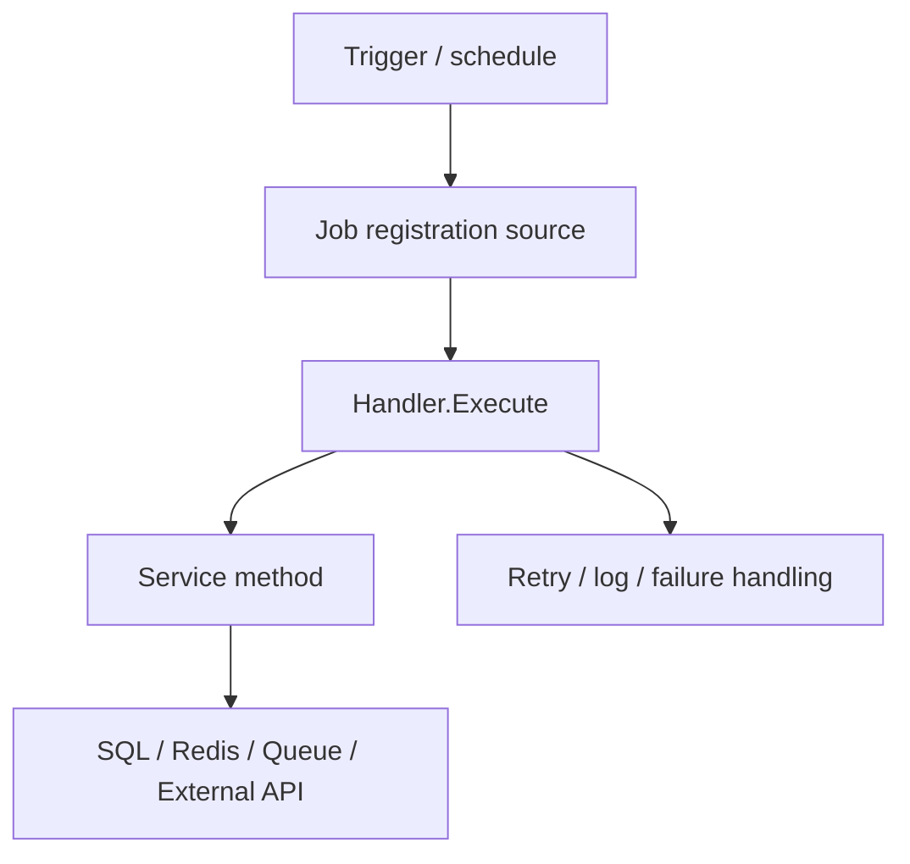
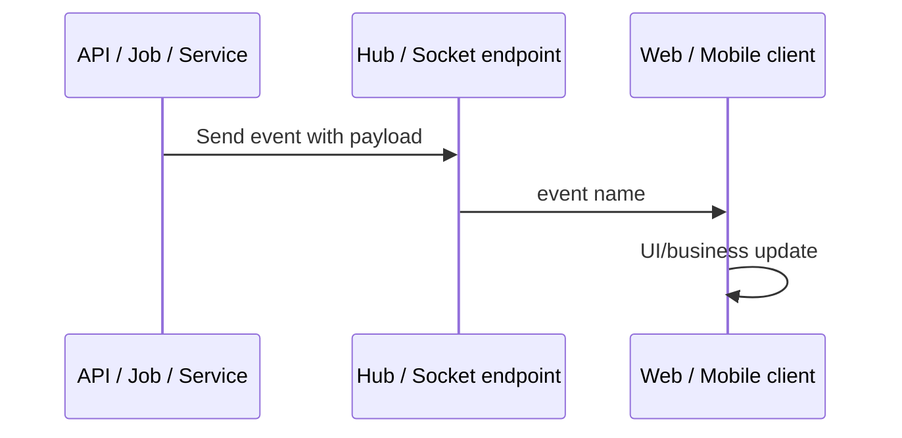

## Role
Cross-Layer Flow And Conflict Verifier

## Required Inputs
- Phase 0 Preflight + Inventory.
- Phase 1 (Agents 1-5) canonical findings.
- Agent 6 source/symbol verification artifacts.
- Evidence store.
- `STATUS.md`.

## Allowed Write Paths
- `.ai/runs/source-code-handover/<run_id>/verification/agent-07/`
- `.ai/runs/source-code-handover/<run_id>/evidence/`

## Canonical Artifact
- `.ai/runs/source-code-handover/<run_id>/verification/agent-07/cross-layer-flow-map.md`
- `.ai/runs/source-code-handover/<run_id>/verification/agent-07/cross-domain-conflicts.md`
- `.ai/runs/source-code-handover/<run_id>/verification/agent-07/claim-triangulation.md`
- `.ai/runs/source-code-handover/<run_id>/verification/agent-07/coverage-reconciliation.md`
- `.ai/runs/source-code-handover/<run_id>/verification/agent-07/readiness-decision.md`

## Investigation Protocol
1. Read Agent 1-5 discovery findings, Agent 6 source/symbol evidence, Phase 0 inventory, and evidence store.
2. Trace cross-layer flows from entry point to controller/handler, service, repository, SQL/Redis/job/queue/external system, exception mapping, response wrapper, logging, and audit behavior when present.
3. Build flow-level evidence using Agent 6 `EV-*` source/symbol claims plus call graph, data-flow, config-to-runtime, SQL/API metadata, or focused source slices.
4. Detect contradictions across domains, such as API route vs auth policy, DTO vs DB schema, config key vs consumer module, Redis producer vs consumer, job registration vs handler, frontend route vs backend route, or business rule vs state transition.
5. Update `data-flow-map.json`, `call-graph-map.json`, `config-to-runtime-map.json`, and `conflict-register.md` when those artifacts exist or create them under `verification/`.
6. Mark claims as `[CONFIRMED]`, `[CONFLICT]`, `[UNVERIFIED]`, or `[BLOCKED]` for Agent 9 documentation use.
7. Write all canonical artifacts in English.
8. Do NOT write final developer documentation.
9. Do NOT run build/test/runtime/ops safety proof; Agent 8 owns that layer.

## Cross-Layer Verification Requirements
- Every high-risk flow must have a start point, intermediate layers, side effects, failure path, and evidence status.
- Every conflict must include the conflicting evidence IDs, affected documents/modules, risk, and required decision or follow-up.
- Every unresolved flow must become an open question or risk for Agent 9.

## Background Job Flow Requirements
If Phase 0, Agent 5, or Agent 6 discovers any hosted service, scheduler, worker, timer, queue, channel, Hangfire job, Quartz job, recurring job, callback worker, or background processing source, Agent 7 MUST produce a business flow map and Mermaid diagram.

For each job/worker, record:

- Job ID/name.
- Registration source and startup path.
- Trigger source: startup, cron, timer, queue, API enqueue, event, callback, or external trigger.
- Schedule/cron/interval and timezone when visible.
- Producer and consumer/handler.
- Queue/storage/backing mechanism.
- Service/repository calls.
- DB/Redis/external side effects.
- Retry, timeout, idempotency, cancellation, shutdown, and failure/logging path when visible.
- Evidence IDs and status for every segment.

Required output files:

- `verification/agent-07/background-job-flow-map.md`
- `verification/agent-07/background-job-diagrams.md`
- updates to `evidence/data-flow-map.json`

Mermaid diagram shape:

If a job exists but Agent 7 cannot prove the full path, record partial flow segments and mark the missing segment `[UNVERIFIED]` or `[BLOCKED]`. Do not let Agent 9 describe the job as fully confirmed.

## Realtime / SignalR Flow Requirements
If Phase 0, Agent 5, or Agent 6 discovers any hub class, hub route, `IHubContext`, WebSocket endpoint, SignalR client, `HubConnectionBuilder`, `.on(`, `.invoke(`, group/user mapping, or realtime event, Agent 7 MUST produce a realtime business flow map and Mermaid diagram.

For each realtime path, record:

- Hub/socket class and mapped route.
- Auth/policy requirements.
- Event producer: controller, service, job, external callback, or hub method.
- Event name and direction.
- Payload fields and source DTO/model.
- Group/user/client selection rule.
- Client handler and UI/business effect when source exists.
- Reconnect, scale-out/backplane, failure handling, and negative evidence when unavailable.
- Evidence IDs and status for every segment.

Required output files:

- `verification/agent-07/realtime-flow-map.md`
- `verification/agent-07/realtime-diagrams.md`
- updates to `evidence/data-flow-map.json`

Mermaid diagram shape:

If realtime assets are absent, Agent 7 MUST use Agent 6 or Agent 8 negative evidence rather than guessing. If realtime assets exist but no client handler is found, mark the client side `[UNVERIFIED]` and create an open question.

## API And Database Flow Requirements
For every high-risk or management API verified by Agent 6, Agent 7 MUST connect the endpoint to request model, auth/permission, service/repository, database tables/columns, cache/job/external side effects, response model, and error path when source permits.

Agent 7 MUST reject or downgrade endpoint claims where Agent 6 verified only the route but request/response DTOs, side effects, or auth path remain missing.

## Acceptance Gate
- All Agent 7 canonical artifacts created.
- Cross-layer maps cover all high-risk modules discovered by Agents 1-5 and verified by Agent 6, or explicitly mark gaps.
- Conflict register is present even when empty.
- Coverage reconciliation is explicit.

## Escalation / Blocked Conditions
Block Agent 9 if high-risk flow conflicts are unresolved without `[CONFLICT]`, `[UNVERIFIED]`, or `[BLOCKED]` status.
