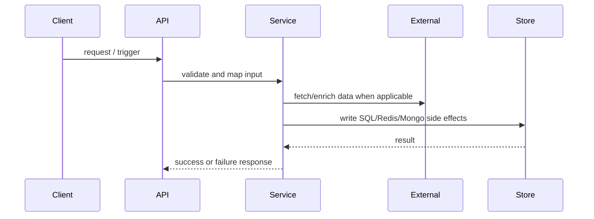
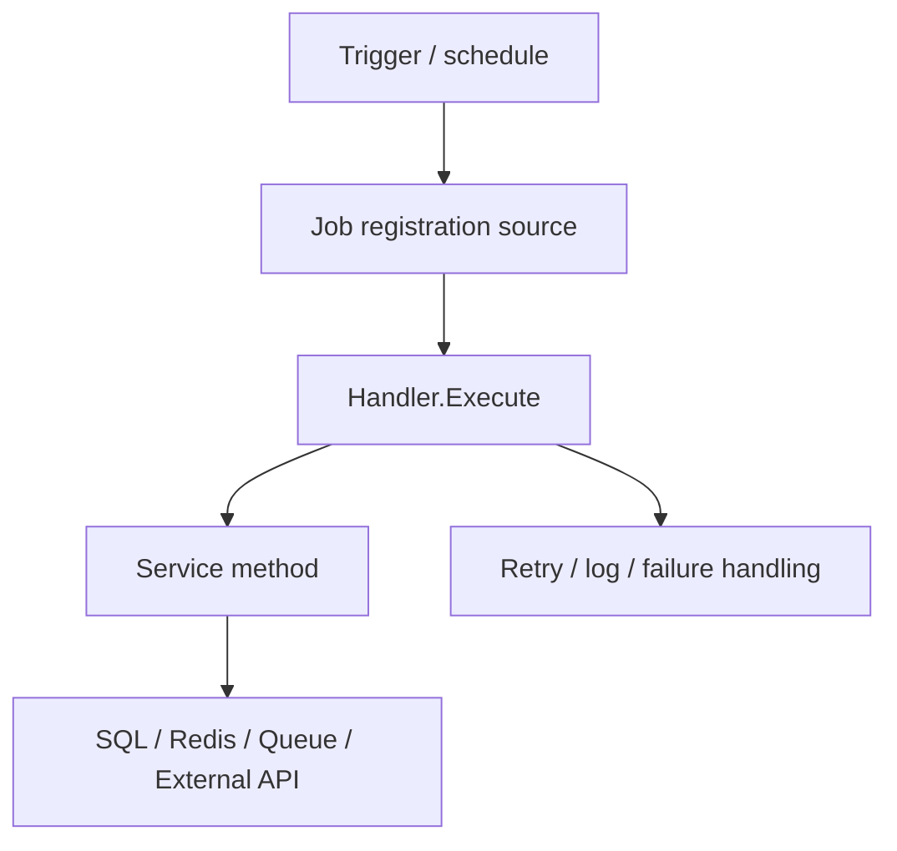
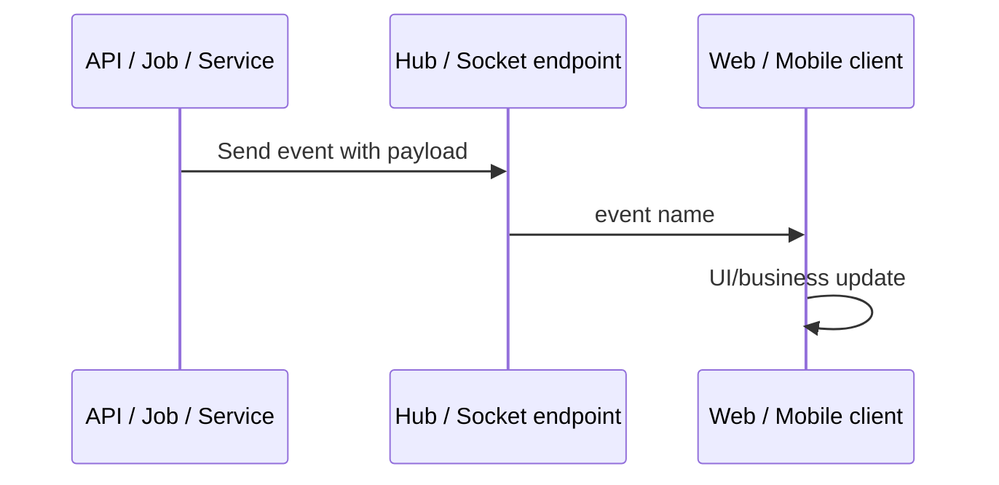

# Source Code Handover Quality Checklist

## Purpose

This rule is the mandatory quality checklist for the 20 final documents produced by workflow `source-code-handover`.

This file is AI-facing and written in English. Literal Vietnamese headings and snippets below are required final-document output, not internal execution language.

## Evidence Store Requirement

Before final Markdown documents are accepted, the run MUST include a machine-readable evidence store:

```text
.ai/runs/source-code-handover/<run_id>/evidence/
```

Required files:

- `tool-runs.jsonl`
- `evidence-manifest.json`
- `focused-slices.json`
- `symbol-reference-map.json`
- `data-flow-map.json`
- `sql-metadata.json`
- `api-contract-sources.json`
- `runtime-artifacts.json`
- `tool-limitations.json`

Agent 10 MUST reject final docs when important claims have no Evidence ID in `evidence-manifest.json`, when focused slices are missing for important claims, or when high-risk flows lack triangulated Agent 6 source/symbol evidence, Agent 7 cross-layer flow/conflict evidence, and Agent 8 safety/runtime evidence or explicit limitations.

## Discovery vs Verified Evidence

Agents 1-5 create broad physical discovery findings. Their `DISC-*` IDs are not final evidence and MUST NOT appear in final documents.

Agent 6 is responsible for promoting discovery candidates into source/symbol verified `EV-*` Evidence IDs after targeted tool verification against physical source files, SQL/API metadata, symbols, routes, tables, keys, jobs, or approved negative evidence.

Agent 7 is responsible for tracing cross-layer flows and conflicts from Agent 6 evidence. Agent 8 is responsible for build/test/runtime/ops/safety evidence. Agent 9 MUST write final Vietnamese docs from Agent 6-8 triangulated `EV-*` evidence only. Agent 10 MUST reject any final document that includes `DISC-*`, model context as proof, or Agent 1-5 prose as proof.

The examples in `.ai/skills/source-code-handover/SKILL.md` and `.ai/templates/source-code-handover/*` are calibration examples. Agents MUST follow their structure, but MUST replace every sample path, route, class, table, Redis key, and Evidence ID with current-repository evidence. Agent 10 MUST reject copied sample values that do not exist in the current run evidence store.

## Scope

This rule applies to every final document in:

```text
.ai/runs/source-code-handover/<run_id>/final/
```

It extends `.ai/rules/07-handover-documentation-dod.md`. If the two rules conflict, this rule is stricter for final document structure and validation.

## Required Front Matter

Every final document MUST start with YAML front matter containing:

```yaml
---
document_id: "DOC-01"
title: "Document title"
run_id: "<run_id>"
source_commit: "<git_sha>"
source_branch: "<branch>"
status: "Ready | Partial | Blocked | Not Applicable"
primary_owner_agent: "agent-xx"
evidence_ids:
  - "EV-XXX-001"
last_verified_at: "<ISO-8601 timestamp>"
---
```

Allowed `status` values are exactly: `Ready`, `Partial`, `Blocked`, `Not Applicable`.

## Readiness Dimensions

`status: "Ready"` in front matter is documentation-readiness only and MUST NOT be used as a shortcut for build, test, runtime, operations, or production readiness.

Every final documentation set MUST include an explicit readiness matrix, preferably in `01_project_handover_full.md` and `20_documentation_coverage.md`:

```yaml
documentation_structure: Ready | Partial | Blocked
source_discovery: Complete | Partial | Insufficient
evidence_quality: Sufficient | Partial | Insufficient
documentation_coverage: Valid | Partial | Invalid Measurement
local_setup_readiness: Ready | Blocked | Not Verified
build_readiness: Ready | Blocked | Not Verified
test_readiness: Ready | Blocked | Not Verified
runtime_readiness: Verified | Not Verified
operations_readiness: Ready | Partial | Blocked
production_handover: Ready | Not Ready | Not Verified | Rejected
```

Agent 9 MUST NOT mark all final documents `Ready` unless Agent 8 has produced build/test/runtime/ops or explicit limitation evidence and Agent 10 has verified it. Agent 10 MUST reject all-Ready output when `EV-TEST-*`, `EV-RT-*` or `EV-OPS-*`, and readiness limitations are absent.

## Inventory-Backed Coverage Gate

`20_documentation_coverage.md` MUST be generated from Phase 0 inventory, not from model estimates. For each domain row, `Discovered` MUST equal the item count in the referenced `inventory/*.json` file.

Agent 10 MUST reject the run when:

- A coverage row claims a `Discovered` number that does not match the actual JSON item count.
- `07_database_reference.md` omits any `DbSet`, entity class, or mapped table from `inventory/dbsets.json` or `inventory/entities.json`, unless the item is explicitly accounted as `Unresolved`, `N/A`, or `Excluded` with linked evidence.
- `09_api_catalog.md` omits any route, controller, action, or endpoint handler from `inventory/routes.json`, unless the item is explicitly accounted as `Unresolved`, `N/A`, or `Excluded` with linked evidence.
- Phase 0 inventory says `status: "complete"` but a source-smoke scan finds substantially more HTTP attributes, endpoint mappings, `DbSet`, `ToTable`, `CreateTable`, or migration table definitions than the inventory recorded.

This gate prevents a document from passing by adding the right headings or sample rows while still missing most database tables/fields or API contracts.

## Skeleton Rejection Gates

Agent 10 MUST reject `DOCUMENTATION_SKELETON_ONLY` output. A final documentation set is a skeleton when it matches any of these patterns:

- Many files exist but important files only contain headings, generic prose, or fewer than the minimum behavior-level sections.
- Most claims reuse one broad evidence ID such as `EV-REPO-001`.
- Evidence IDs prove categories or existence only, while final claims describe behavior, readiness, contracts, or operations.
- Coverage denominators count categories instead of assets, such as `DbContext = 1` when multiple DbContexts are discovered.
- `20_documentation_coverage.md` reports PASS without asset-level denominator from Phase 0 inventory.
- `04_local_setup.md` lacks real run prerequisites, startup order, ports/URLs, DB/config setup, smoke checks, and troubleshooting.
- `16_testing_guide.md` lists test projects but has no observed test command result or explicit `[UNVERIFIED]` limitation.
- `14_operations_runbook.md` lacks service topology, health/log checks, incident runbooks, rollback, and escalation.
- All or most documents are marked `Ready` while build/test/runtime/operations readiness remains `Not Verified`.

Minimum content is not a word-count game, but Agent 10 MUST use size as a smoke signal: important non-`Not Applicable` docs under roughly 300 words, or a 20-file set under roughly 7,000 words, require rejection unless the repository is demonstrably tiny and the limitation is explicit.

## Required Common Sections

Every final document MUST include these sections:

- `## Phạm vi`
- `## Trạng thái`
- `## Nguồn dữ liệu / Evidence`
- `## Nội dung chính`
- `## Hạn chế`
- `## Câu hỏi mở`
- `## Rủi ro`

If there are no open questions or no document-specific risks, write:

```md
## Câu hỏi mở
Không có.

## Rủi ro
Không có rủi ro riêng ngoài các mục đã ghi trong `17_known_risks.md`.
```

## Claim Status Labels

Important technical claims MUST use one of:

- `[CONFIRMED]`
- `[INFERRED]`
- `[UNVERIFIED]`
- `[CONFLICT]`
- `[NOT_APPLICABLE]`
- `[BLOCKED]`
- `[UPSTREAM_REFERENCE]`
- `[DECISION]`

`[CONFIRMED]` claims require Evidence IDs listed in `19_evidence_index.md`.
Every assumption MUST be labeled `[UNVERIFIED]`. Every conflict MUST be labeled `[CONFLICT]`. Every documented behavior-preservation or migration behavior choice MUST be labeled `[DECISION]` and include a decision owner or required owner confirmation.

## Evidence IDs

Every Evidence ID used in any final document MUST appear in `19_evidence_index.md`.
Every Evidence ID used in any final document MUST also appear in `evidence/evidence-manifest.json`.
`DISC-*` discovery IDs are allowed in Agent 1-5 findings only and are forbidden in final documents.

Allowed patterns:

- `EV-REPO-###`
- `EV-CONFIG-###`
- `EV-DB-###`
- `EV-MIGRATION-###`
- `EV-AUTH-###`
- `EV-API-###`
- `EV-JOB-###`
- `EV-RT-###`
- `EV-OPS-###`
- `EV-CICD-###`
- `EV-TEST-###`
- `EV-NEG-###`
- Domain-expanded negative IDs such as `EV-NEG-RT-###` are allowed only when they are indexed in `19_evidence_index.md`.

Evidence MUST include source path, class/method or line range, verification type, and source commit. A class name alone is not evidence.
For `source_type=source`, the evidence source path MUST resolve to an existing file in the checked-out repository unless explicitly marked `[BLOCKED]` with a limitation. For runtime, SQL, API contract, or git history evidence, the source object/artifact MUST be listed in the evidence store.

Evidence atomicity rules:

- One Evidence ID should support one narrow claim or one tightly scoped flow.
- A broad inventory evidence such as "solution contains 17 projects" MUST NOT be used to prove readiness, architecture correctness, DB behavior, API contract, CI/CD, local setup, or production handover.
- Reusing the same non-negative Evidence ID across many unrelated final docs is a skeleton smell and MUST be rejected unless the claim is explicitly the same narrow claim.
- Build readiness requires `EV-TEST-*`, `EV-CICD-*`, or Agent 8 build evidence. Test readiness requires observed test evidence or an explicit `[UNVERIFIED]` / `[BLOCKED]` limitation. Runtime readiness requires `EV-RT-*` or explicit runtime limitation.

## Documentation Capability Requirements

The final documentation set MUST allow a new developer, tech lead, BA, or AI agent with no prior project knowledge to answer these questions accurately:

- What does the system do?
- Who uses it?
- Which API supports which business capability?
- Where is each important value read from and written to?
- Which business rules must be preserved?
- How do Redis/cache, background jobs, queues, and external APIs work?
- Where are authentication and authorization checked?
- Which behavior must not change during migration or modernization?
- How can old and new behavior be proven equivalent?
- How can a module be rolled back when production fails?

Do not write generic summaries. Reject vague statements such as:

```md
Module Accounts quản lý tài khoản.
```

Require evidence-backed, behavior-level documentation such as:

```md
[CONFIRMED] Module `Accounts` quản lý tài khoản theo phạm vi `channel_id`. API tạo tài khoản resolve `channel_id` từ request; nếu request không có giá trị thì fallback về authenticated context. `username` phải unique trong phạm vi `channel_id`. Khi tạo thành công, hệ thống insert bảng `Accounts`, ghi audit log và invalidate Redis key `account:*`.

Evidence:
- EV-API-021
- EV-DB-044
- EV-OPS-009
```

## Required 80 Percent Code Understanding Depth

The final documentation set MUST explain enough behavior that a new developer can understand the main 80% of the repository without opening source files line-by-line. This is stricter than listing routes, projects, tables, jobs, and integrations.

For each important API, worker, realtime path, integration, config-driven behavior, and data-store flow, final docs MUST include:

- Entry point.
- Actor/client.
- Trigger.
- Input/source data.
- Processing logic and branch conditions.
- Internal call chain.
- External/downstream calls.
- DB/Redis/Mongo/queue/realtime side effects.
- Config keys that enable, schedule, route, or alter behavior.
- Success state and error/failure behavior.
- Debug/verification command, query, or log location when operationally relevant.
- Evidence IDs and source paths.

Use this behavior-flow table shape in the relevant docs:

```md
| Flow ID | Entry point | Actor/client | Trigger | Input/source data | Processing logic | Internal call chain | External/downstream calls | Data-store side effects | Config keys | Success/error behavior | Debug/smoke check | Evidence | Status |
|---|---|---|---|---|---|---|---|---|---|---|---|---|---|
```

Use Mermaid `sequenceDiagram` or `flowchart` for high-risk paths:



Agent 10 MUST reject docs that only say a component "manages", "handles", "uses", "calls", or "integrates with" something without the concrete source-to-sink data flow and business logic.

Agent 10 MUST reject any final doc containing "Required ... Keywords", "Keywords checklist", or similar validator-facing text.

## Required System Overview Content

`01_project_handover_full.md`, `02_project_context.md`, and `06_architecture.md` MUST collectively document:

- System purpose.
- User/client groups.
- Main domain/module list.
- External integrated systems.
- Databases.
- Cache/Redis behavior.
- Background jobs.
- Queues or negative evidence that no queue was found.
- Client applications.
- Runtime environments.
- Main operational and migration risks.
- Actors and external systems.

The overview MUST include a system flow diagram, using exact current-source components where found:

```text
User / Client
→ API Gateway hoặc Web Server
→ Legacy .NET Framework Application hoặc current backend host
→ SQL Server
→ Redis
→ Hangfire/Background Job
→ External API
→ SMTP/Storage/Queue
```

If a component is not present, mark it `[NOT_APPLICABLE]` with negative evidence. Do not invent it.

## Required Module Inventory

The final docs MUST include a module inventory table with at least these columns:

```md
| Module | Chức năng | API | Tables | Redis | Jobs | Risk | Evidence | Status |
|---|---|---|---|---|---|---|---|---|
```

Example shape:

```md
| Authentication | Xác thực/token | `/oauth/token` | `Tokens`, `Accounts` | token cache | cleanup | High | EV-AUTH-001, EV-DB-004 | [CONFIRMED] |
| Accounts | Quản lý tài khoản | `/accounts` | `Accounts` | account cache | none | Medium | EV-API-002, EV-DB-010 | [CONFIRMED] |
| Quiz Games | Quản lý game | `/quiz-games` | `QuizGames` | game cache | publish | Medium | EV-API-003, EV-JOB-002 | [CONFIRMED] |
| Quiz Submit | Nộp bài | `/quiz-submit` | `QuizResponses` | ranking cache | callback | High | EV-API-004, EV-OPS-003 | [CONFIRMED] |
```

## Required Project Inventory

Every project in the solution/repository MUST be documented with:

- Project name.
- Project path.
- Project type.
- Target framework.
- Startup point.
- Main responsibility.
- Dependencies.
- Database access.
- Redis access.
- External integration.
- Migration difficulty.
- Risk.
- Owner.
- Status.

Use this table shape:

```md
| Project name | Project path | Project type | Target framework | Startup point | Main responsibility | Dependencies | Database access | Redis access | External integration | Migration difficulty | Risk | Owner | Status | Evidence |
|---|---|---|---|---|---|---|---|---|---|---|---|---|---|---|
```

## Required Actors And External Systems

Document actors such as `Admin`, `Editor`, end user, mobile app, web frontend, third-party auth, payment service, email service, news service, storage service, and analytics service only when found or inferred with evidence.

Every external system MUST have:

- Name.
- Purpose.
- Protocol.
- Auth method.
- Direction.
- Criticality.
- Fallback.
- Owner.
- Evidence.
- Status.

Use this table shape:

```md
| External system | Purpose | Protocol | Auth method | Direction | Criticality | Fallback | Owner | Evidence | Status |
|---|---|---|---|---|---|---|---|---|---|
```

## Required Dependency Compatibility Inventory

The final docs MUST list NuGet packages, internal DLLs, COM dependencies, Windows dependencies, and other runtime dependencies discovered from source/config.

Use this table shape:

```md
| Dependency | Current Version | Used By | Purpose | .NET 8 Compatibility | Replacement | Risk | Evidence | Status |
|---|---|---|---|---|---|---|---|---|
```

Compatibility classification MUST be one of:

- `Compatible directly`
- `Compatible with upgrade`
- `Needs adapter`
- `Needs replacement`
- `Needs rewrite`
- `Unknown / POC required`

## Required Configuration Mapping

The final docs MUST map all discovered:

- `Web.config`
- `App.config`
- Connection strings.
- AppSettings.
- Environment variables.
- Secrets, redacted.
- Certificates.
- File paths.
- IIS settings.
- Scheduled jobs config.
- Feature flags.

Use this table shape:

```md
| Key | Purpose | Environment | Required/Optional | Secret/Non-secret | Legacy location | .NET 8 target location | Consumer module | Risk if missing | Evidence | Status |
|---|---|---|---|---|---|---|---|---|---|---|
```

Secret values MUST be redacted. Preserve key names.

## Required Architecture Content

`06_architecture.md` MUST document:

- Application layers.
- Dependency direction.
- Entry points.
- Controller/service/repository flow.
- Configuration flow.
- Authentication flow.
- Authorization flow.
- Exception flow.
- Logging flow.
- Background job flow.
- Data flow.

C4 diagrams are mandatory:

- C1 System Context.
- C2 Container Diagram.
- C3 Component Diagram for each high-risk module when present.

C3 is required for high-risk modules such as Authentication, Authorization, Quiz Submit, Payment, Lucky Draw, Background Job, Redis-heavy modules, or external integration modules. Do not draw C3 for every class.

Legacy or current request lifecycle MUST identify where validation, auth, exception mapping, response wrapping, and audit logging happen:

```text
HTTP Request
→ IIS or current web host
→ Global.asax / Program.cs / Startup.cs
→ OWIN middleware or ASP.NET Core middleware
→ Authentication
→ Authorization
→ Filter
→ Controller
→ Service
→ Repository
→ SQL / Redis / Job / External API
→ Exception handler
→ HTTP Response
```

If the stack is not legacy .NET Framework, adapt the labels to current source and mark missing legacy components `[NOT_APPLICABLE]` with negative evidence.

## Required Domain And Business Rules

Final docs MUST describe business entities, not only database entities. Examples include `Account`, `Channel`, `Quiz Game`, `Quiz Question`, `Question Option`, `Quiz Response`, `Gift`, `Challenge`, `Template`, `Role`, and `Permission` when present.

Each business entity MUST document:

- Business meaning.
- Identifier.
- Lifecycle.
- Status/state.
- Relationships.
- Important rules.
- Related APIs.
- Related tables.
- Evidence.
- Status.

Every important business rule MUST use this structure:

```md
### Rule ID: BR-<DOMAIN>-###

#### Name
<Vietnamese rule name.>

#### Scope
<Module or entity scope.>

#### Trigger
<API route, job, event, UI action, or scheduler.>

#### Preconditions
- <Condition with evidence.>

#### Processing
1. <Step.>
2. <Step.>

#### Output
- HTTP response.
- Database record.
- Redis mutation.
- Audit log.

#### Failure Rules
- <Failure case.>

#### Compatibility Rule
Behavior phải giữ nguyên khi migrate sang .NET 8, unless a `[DECISION]` says otherwise.

#### Evidence
- Source path.
- Class.
- Method.
- Related SQL/Redis key.
```

Business entities with fields named `status`, `type`, `kind`, or `state` MUST include a state transition table:

```md
| From state | To state | Allowed/Forbidden | Actor allowed | Validation condition | Side effect | Database update | Cache invalidation | Job/event trigger | Evidence | Status |
|---|---|---|---|---|---|---|---|---|---|---|
```

Do not write only `status = 1 là active`. Explain behavior:

```md
[CONFIRMED] `status = 1` nghĩa là Active. Chỉ `Admin` hoặc `Owner` có thể chuyển từ Draft sang Active. Khi Active, game được phép public access. Khi Closed, không được tạo `QuizResponse` mới.
```

## Required Compatibility Quirks

Document behaviors that are unusual but must be preserved, including:

- Client sends `form-urlencoded` instead of JSON.
- Field name contains a typo but clients depend on it.
- API returns HTTP 200 for some business errors.
- `channel_id` fallback from claim/authenticated context.
- `answer_id` contains multiple comma-separated IDs.
- Endpoint uses `officer_id` while database stores `channel_id`.
- Redis value is a plain string instead of JSON.

Each quirk MUST include:

- Description.
- Known reason, or `[UNVERIFIED]` if unknown.
- Affected client/dependency.
- Whether it must be preserved.
- Retirement plan after migration.
- Decision owner.
- Evidence.
- Status.

Use this table shape:

```md
| Quirk ID | Description | Known reason | Affected client/dependency | Preserve? | Retirement plan | Decision owner | Evidence | Status |
|---|---|---|---|---|---|---|---|---|
```

## Required API Contract Detail

Every endpoint MUST document:

- Route.
- HTTP method.
- Authentication.
- Required permission.
- Request content type.
- Headers.
- Query parameters.
- Request model.
- Validation rules.
- Response model.
- Success response.
- Error response.
- Status codes.
- Database side effects.
- Redis side effects.
- Jobs/events.
- External API calls.
- Auth header shape or explicit negative evidence.
- Copy-pastable curl smoke command.
- Known quirks.
- Evidence.
- Status.

Use this table shape:

```md
| API ID | Route | Method | Controller/action | Auth/header | Content type | Request DTO | Request fields | Request example | Response DTO | Response fields | Success example | Error example | Status codes | Validation/business rules | Data side effects | External calls | Known quirks | Evidence | Status |
|---|---|---|---|---|---|---|---|---|---|---|---|---|---|---|---|---|---|---|---|
```

Do not put `Client path`, `Versioning`, `Timeout`, `Retry`, `Idempotency`, `Rate limit`, or `Postman` as repeated columns in the main API contract matrix. These fields caused agents to invent placeholder values. If they exist in source/config/runtime evidence, document them in a separate policy table:

```md
| Policy area | Applies to routes | Source/config/test artifact | Behavior | Client guidance | Evidence | Status |
|---|---|---|---|---|---|---|
```

For systems used through an API Gateway or by another application, `09_api_catalog.md` MUST also include an application integration note only when gateway/proxy evidence exists. Route and client path are the same unless source/config proves a gateway rewrite. Do not duplicate `Route` and `Client path` in the same matrix.

Agent 10 MUST reject `09_api_catalog.md` when a developer from another app cannot determine the exact URL to call, required auth/headers, request/response/error shape, proxy/upstream mapping when present, and a safe smoke command.

Each API integration row MUST be evidence-bound. A row marked `[CONFIRMED]` MUST NOT contain invented or recommendation-only values for timeout, retry, fallback, rate limit, auth header, status/error behavior, success/error examples, `Curl/Postman/OpenAPI`, smoke command, owner, or upstream contract. If these values are not present in source config, OpenAPI/Postman/tests, runtime artifacts, or explicit negative evidence, mark the row or cell `[UNVERIFIED]`, `[INFERRED]`, `[NOT_APPLICABLE]`, or `[BLOCKED]`.

Agent 10 MUST reject synthetic filler values in API docs, including numbered headers (`X-Secret-Key-1`), numbered validation rules (`ValidationRulesV1`), numbered generic errors (`Error 1`), numbered request/body placeholders (`Request Body 1 data`), fake config markers (`appsettings.json (1)`), generated status-code sequences, generated timeout/rate-limit sequences, or examples that cannot be traced to source/runtime evidence.

## Required Database Deep Detail

`07_database_reference.md` MUST go beyond connection strings and DbContext names. When a database is present, it MUST include:

- DbContext inventory with source path, owning project, registration point, connection string key, migration assembly, and target database when known.
- DbSet/entity/table inventory with mapping source.
- Field dictionary for important tables/entities, including column/property name, CLR type, DB type when available, nullable/required, default/max length, PK/FK/index/unique constraint, meaning, and read/write consumers.
- Redis/cache data-store contract when Redis is present: store name, key prefix/pattern, data type, key inputs, field/member/value shape, serialized DTO shape, score meaning for sorted sets, TTL/expiry or no-expiry evidence, producer/write path, consumer/read path, jobs/APIs affected, rebuild/invalidation path, SQL/Mongo sync source, drift risk, evidence, and status.
- Mongo/document-store contract when MongoDB is present: collection name, document model, source path, important fields including nested fields, ID/index/date/status semantics when available, producer/write path, consumer/read path, data volume/retention notes when source-visible or `[UNVERIFIED]`, evidence, and status.
- Relationship map or ERD when relationships are found.
- Migration/schema source coverage.
- Table/API/job/cache consumer map across SQL, Redis, Mongo, queues, and background jobs.
- Data consistency map: source of truth, sync direction, stale-data window/TTL, job/API/config that refreshes data, drift symptoms, reconciliation/rebuild procedure or explicit limitation.
- Data mutation lineage matrix: every important SQL table, Mongo collection, Redis key family, queue, and realtime event must be traceable to the exact API/job/service entry points that create, update, delete, rebuild, invalidate, or read it. This must include ID/key source, field/value changed, value source, call chain, secondary side effects, consistency rule, debug query/command, evidence, and status.
- Coverage row for entities/tables/columns using asset-level denominator.

Use these table shapes:

```md
| DbContext | Source path | Project | Registration point | Connection string key | Migration assembly | Database | Evidence | Status |
|---|---|---|---|---|---|---|---|---|

| Entity | Table/schema | Columns documented | PK | FK/relationships | Used by APIs/jobs | Mapping source | Evidence | Status |
|---|---|---:|---|---|---|---|---|---|

| Table | Column | CLR type | DB type | Nullable | Key/index | Meaning/rule | Read/write path | Evidence | Status |
|---|---|---|---|---|---|---|---|---|---|

| Store | Key pattern | Data type | Key inputs | Field/member/value shape | TTL | Producer/write path | Consumer/read path | Jobs/APIs affected | Rebuild/invalidation | Drift risk | Evidence | Status |
|---|---|---|---|---|---|---|---|---|---|---|---|---|

| Collection | Document model | Field path | Type | Required/null | Meaning/rule | Producer/write path | Consumer/read path | Index/retention | Evidence | Status |
|---|---|---|---|---|---|---|---|---|---|---|

| Data asset | Asset type | Operation | Entry point | Actor/client | ID/key source | Field/value changed | Value source | Call chain | Also updates | Read consumers | Consistency rule | Debug query/command | Evidence | Status |
|---|---|---|---|---|---|---|---|---|---|---|---|---|---|---|
```

Agent 10 MUST reject `07_database_reference.md` when it only names `Clients`, connection string `IdentityServer4Admin`, DbContexts, Redis stores, or Mongo collections without table/field/key/value coverage.

Agent 10 MUST additionally compare `07_database_reference.md` against `inventory/dbsets.json`, `inventory/entities.json`, `inventory/sql-metadata.json`, and migration/table metadata. Every discovered `DbSet`, entity, mapped table, and important column must appear in the final document or be accounted as unresolved with evidence.

Agent 10 MUST additionally compare `07_database_reference.md` against `inventory/redis-cache.json`, Redis source symbols, and queue/job inventories. Every discovered Redis store/key family must appear with a concrete key pattern or an explicit `[UNVERIFIED]` key-pattern gap. Redis cannot be documented only as `None (Redis Hash)` or `None (Redis ZSet)`.

Agent 10 MUST reject when a developer cannot answer from the docs: which APIs/jobs mutate Redis key family A, which APIs/jobs read it, which request/route/header/config/external-response fields provide the key and value, which SQL/Mongo table or collection is also changed, how to verify the current value, and what drift or rebuild path exists.

Agent 10 MUST reject database docs containing "Required Database Reference Keywords" or similar keyword checklists. These are validation artifacts, not handover documentation.

## Required API Discovery Completeness

`09_api_catalog.md` MUST reconcile every discovered route/action, not only common management pages.

It MUST include:

- Asset-level route coverage from Phase 0 `routes.json`.
- Full route/action matrix for controllers, MVC areas, Razor handlers, minimal APIs, and legacy route tables when present.
- Request DTO/model field table per endpoint or endpoint group.
- Response DTO/model/wrapper field table per endpoint or endpoint group.
- Validation source and error/status behavior.
- Auth/permission source.
- Side-effect map to DB/cache/job/external/audit/log.
- Data mutation detail: table/key/collection name, operation (`read`, `insert`, `update`, `delete`, `upsert`, `increment`, `HashSet`, `SortedSetAdd`, enqueue, emit), ID/key source, field/value changed, value source, and read-after-write consumers.
- Endpoint-level route coverage: every route/action discovered in `inventory/routes.json` must have its own API contract row and its own behavior flow row. A `Complete Discovered Routes and Actions` inventory table is only discovery coverage and MUST NOT count as request/response or behavior documentation.
- Endpoint-level request/response detail: every route/action must include request fields, request example, response fields, success example, error example, status codes, validation, auth/header, content type, side effects, evidence, and status, or an explicit `[UNVERIFIED]`/`[BLOCKED]` gap with evidence.

Use these table shapes:

```md
| API ID | Route | Method | Action | Request fields | Response fields | Validation | Auth/permission | DB/cache/job/external side effects | Evidence | Status |
|---|---|---|---|---|---|---|---|---|---|---|

| API ID | Field location | Field | Type | Required | Validation/default | Source DTO/model | Evidence | Status |
|---|---|---|---|---|---|---|---|---|
```

Agent 10 MUST reject `09_api_catalog.md` when request/response is missing for discovered endpoints or when route coverage cannot be reconciled against Phase 0 inventory.

Agent 10 MUST additionally compare `09_api_catalog.md` against `inventory/routes.json` and `inventory/api-contract-sources.json`. Every discovered route/action must appear in the final document with request/response fields or an explicit unresolved gap. A few representative API rows are not sufficient.

Agent 10 MUST compare discovered route count to endpoint-level contract and behavior counts. If `Complete Discovered Routes and Actions` has all routes but `API Contract Matrix`, request/response details, or `Behavior Flow Table` covers only a subset, the document is `Partial` at best and the final quality gate must fail.

## Required External Integration Detail

`12_external_integrations.md` MUST document every discovered external API, service discovery system, third-party service, upstream microservice, downstream microservice, queue broker, cache server, object storage, webhook/callback target, or gateway destination.

Each integration MUST include:

- External system/service name.
- Caller/source module.
- Trigger.
- Protocol/transport.
- Direction.
- Auth method without secret values.
- Config keys and environment source.
- Request/response or data contract, or explicit unresolved marker.
- Timeout/retry/fallback/failure behavior.
- Health/smoke check or test strategy.
- Owner when known.
- Evidence.
- Status.

Use this table shape:

```md
| Integration ID | External system | Caller | Trigger | Protocol | Direction | Auth method | Config keys | Contract | Timeout/retry/fallback | Failure behavior | Health/test strategy | Owner | Evidence | Status |
|---|---|---|---|---|---|---|---|---|---|---|---|---|---|---|
```

Agent 10 MUST reject `12_external_integrations.md` when it only says a system integrates with Consul/Redis/another service but does not identify caller, trigger, config keys, contract, failure behavior, and test strategy.

`12_external_integrations.md` MUST NOT invent config paths, owners, timeout/retry/fallback values, health endpoints, or partner API contracts. Every config path such as `RedisDataProtection` or `ReverseProxy:Clusters:music-cluster` must match keys found in current configuration files, or the row must be marked `[UNVERIFIED]` with an open question.

## Required Operations Debug And Fault Isolation Detail

`14_operations_runbook.md` MUST help an operator isolate faults across client, gateway/proxy, auth, upstream service, database, Redis/cache/data-protection, background jobs, realtime, external integrations, configuration, TLS/CORS, and deployment.

It MUST include:

- Runtime topology and service map.
- Domain/port map.
- Environment/config source.
- Dependency map.
- Health endpoints and smoke commands.
- Log paths/commands and trace/correlation IDs when present or explicit negative evidence.
- Reverse proxy routing and upstream destination map when gateway routes exist.
- Restart/scaling behavior.
- Secret rotation and certificate/TLS notes when source-visible or explicit limitation.
- Rollback procedure.
- Escalation owner/path when known or explicit open question.
- Incident/fault isolation matrix.

Use this table shape:

```md
| Symptom | Likely layer | First check | Verification command/log/query | Fix/next action | Rollback | Escalation | Evidence | Status |
|---|---|---|---|---|---|---|---|---|
```

Minimum incident families to account for when relevant:

- `401/403` authentication or authorization failure.
- `404` route not matched.
- `502/504` upstream unavailable or timeout.
- Config reload or service discovery failure.
- Redis/cache/data-protection failure.
- Database connectivity, migration, lock, or query failure when DB exists.
- External API timeout or contract failure.
- SignalR/WebSocket failure when realtime exists.
- Background queue saturation or job failure when jobs exist.
- CORS/TLS/certificate failure.
- Deployment rollback.

Agent 10 MUST reject runbooks that only say "restart service" or list generic incidents without a verification command, layer isolation, fix/next action, rollback, and evidence.

Runbook commands MUST be executable against routes, ports, log paths, or runtime artifacts discovered in the current repo. For example, do not document `GET /health` for an upstream service unless that endpoint exists in source/config/runtime evidence. Do not document Docker, Kubernetes, certificate, trace, owner, or rollback procedures as `[CONFIRMED]` unless the repository or runtime evidence contains them.

## Required Background Job Flow Diagrams

`10_background_jobs.md` MUST include a flow diagram for each discovered job/worker family unless `[NOT_APPLICABLE]` negative evidence proves no jobs exist.

The document MUST be inventory-backed. Every job, scheduler, hosted service, worker, queue producer, and queue consumer discovered in `inventory/background-jobs.json` MUST appear by exact source name in `10_background_jobs.md`, unless explicitly accounted for as `Excluded`, `[UNVERIFIED]`, `[CONFLICT]`, or `[BLOCKED]` with evidence and an open question.

Each job MUST include:

- Job ID and exact job/source name.
- Source path.
- Registration source.
- Trigger/schedule.
- Cron expression or explicit `[UNVERIFIED]`.
- Producer.
- Consumer/handler.
- Queue/storage.
- Service/repository calls.
- DB/Redis/external side effects.
- Retry/timeout/idempotency/failure/logging/shutdown behavior or explicit `[UNVERIFIED]`.
- Evidence and status.
- Mermaid flowchart plus Mermaid `sequenceDiagram` for scheduler/worker/handler/store/failure timing.

Use this diagram shape:



Agent 10 MUST reject `10_background_jobs.md` when jobs are discovered but no Mermaid flowchart or lifecycle table exists.

Agent 10 MUST also reject `10_background_jobs.md` when it contains validator keyword checklists, when the job table has fewer job rows than the discovered inventory count, when discovered job names/handlers are absent, or when it only documents a few representative jobs in a repository where business logic is mainly in background workers.

## Required Realtime Flow Diagrams

`11_realtime_signalr_socket.md` MUST include a realtime flow diagram and event contract table for each discovered hub/socket/event family unless `[NOT_APPLICABLE]` negative evidence proves realtime is absent.

Each realtime path MUST include:

- Hub/socket class.
- Route mapping.
- Auth/policy.
- Producer.
- Event name and direction.
- Payload fields.
- Group/user/client mapping.
- Client handler when found, or `[UNVERIFIED]`.
- Reconnect/backplane/failure behavior or explicit limitation.
- Mermaid sequence diagram.

Use this diagram shape:



Agent 10 MUST reject `11_realtime_signalr_socket.md` when realtime assets are discovered but no diagram or event contract table exists.

## Required Migration Safety Content

The final docs MUST answer:

- If migrated to .NET 8, what must not change?
- How can the new system prove it behaves like the old system?
- What baseline tests, smoke tests, contract tests, or data comparisons are required before migration?
- How can a new module be rolled back if production fails?

Use this table shape:

```md
| Behavior / Module | Must not change | Baseline proof | .NET 8 target risk | Rollback plan | Owner | Evidence | Status |
|---|---|---|---|---|---|---|---|
```

## Final Documentation Acceptance Questions

Agent 10 MUST reject the documentation unless the final set can answer these checks with evidence or explicit `[NOT_APPLICABLE]` negative evidence:

- Dev mới có thể chạy hệ thống local từ tài liệu không?
- AI có thể xác định entry point và request lifecycle không?
- Có biết mọi API thuộc module nào không?
- Có biết request, response, status code và error contract không?
- Có biết business rule nằm ở đâu không?
- Có biết table/column/status field có ý nghĩa gì không?
- Có biết Redis key nào được đọc/ghi/xóa không?
- Có biết job nào được tạo và retry ra sao không?
- Có biết external API nào được gọi không?
- Có biết quyền được kiểm tra ở đâu không?
- Có test baseline trước migration không?
- Có thể chứng minh .NET 8 giữ nguyên behavior không?
- Có rollback được khi production lỗi không?
- Mọi kết luận quan trọng có evidence không?
- Có phân biệt observed, inferred, unverified, conflict và decision không?

## Not Applicable Rule

`[NOT_APPLICABLE]` is valid only with negative evidence:

- Component/scope checked.
- Source roots.
- Search patterns.
- Command/tool or CodeGraph query.
- Result count.
- Operational impact.
- Evidence ID such as `EV-NEG-###` or `EV-NEG-RT-###`.

Do not use `Not Applicable` because the agent ran out of time or lacked enough context.

## Forbidden Content

Final docs MUST NOT present these as current repository behavior without `[UPSTREAM_REFERENCE]` and evidence:

- `dotnet new` or template creation instructions, unless the repo is template tooling.
- A repository URL different from the current git remote.
- Example Docker images, domains such as `example.com`, or placeholder setup.
- Real secrets, passwords, client secrets, API keys, JWT keys, or connection strings.
- `Password123`, `Secret123`, `your-api-key`, `your-client-secret`.
- Invented APIs, hubs, jobs, test code, backup behavior, log rotation, or integrations.
- Vague alternatives such as `Hangfire or Quartz`, `Hangfire hoặc Quartz`, `Redis or some cache`, or `Redis hoặc cache nào đó`.
- Upstream Gitter, PayPal, Patreon, or template content outside a clearly labeled `[UPSTREAM_REFERENCE]` section.

## Canonical Examples For High-Quality Output

Agent 9 MUST use these examples as structure patterns when assembling final documents.
Agent 10 MUST use these examples as pass/fail calibration when validating quality.
Do not copy example values into final docs; replace every project name, path, route, command, and Evidence ID with current-repository evidence.

### Example: Good Front Matter

```yaml
---
document_id: "DOC-04"
title: "Local Setup"
run_id: "source-code-handover-20260624-153000"
source_commit: "4f2a9c1"
source_branch: "main"
status: "Partial"
primary_owner_agent: "agent-01"
evidence_ids:
  - "EV-REPO-001"
  - "EV-CONFIG-003"
last_verified_at: "2026-06-24T15:30:00+07:00"
---
```

Why this passes:

- `document_id` matches the filename number.
- Status is one of the allowed values.
- Evidence IDs are real IDs that must exist in `19_evidence_index.md`.
- The document owner maps back to the agent responsible for the evidence.

### Example: Bad Front Matter

```yaml
---
title: "Setup"
status: "Done"
evidence_ids: []
---
```

Why this fails:

- Missing `document_id`, `run_id`, `source_commit`, `source_branch`, `primary_owner_agent`, and `last_verified_at`.
- Status `Done` is not allowed.
- Empty evidence makes the document non-auditable.

### Example: Good Evidence-Backed Claim

```md
[CONFIRMED] Project API bật Swagger trong pipeline development.

Evidence:
- EV-API-014
- Source: `src/AdminApi/Startup.cs`, method `Configure`
- Verification type: Source
- Source commit: `4f2a9c1`
```

Why this passes:

- The claim is specific and testable.
- It references a source path and method, not just a class name.
- The Evidence ID must be present in `19_evidence_index.md`.

### Example: Bad Evidence Claim

```md
[CONFIRMED] Hệ thống có Swagger.

Evidence:
- Startup.cs
```

Why this fails:

- The claim is too broad.
- `Startup.cs` alone is not an Evidence ID.
- There is no source path, method/line, verification type, or source commit.

### Example: Good Not Applicable Section

```md
Status: [NOT_APPLICABLE]

Đã kiểm tra:
- Source roots đã kiểm tra: `src/`, `apps/`, `services/`
- Pattern đã tìm: `Hub<`, `MapHub`, `IHubContext`, `HubConnectionBuilder`, `.on(`, `.invoke(`
- Lệnh/công cụ: `rg -n "Hub<|MapHub|IHubContext|HubConnectionBuilder|\\.on\\(|\\.invoke\\(" src apps services`
- Kết quả: 0 hub registration, 0 runtime hub class, 0 production realtime client usage.

Tác động:
- Không cần runbook SignalR cho source commit hiện tại.

Evidence:
- EV-NEG-RT-001
```

Why this passes:

- It documents what was searched, where, by which tool, and what the negative result means.
- The negative evidence is traceable through an Evidence ID.

### Example: Bad Not Applicable Section

```md
[NOT_APPLICABLE] Không thấy SignalR.
```

Why this fails:

- No source roots.
- No search patterns.
- No command/tool.
- No result count.
- No operational impact.
- No negative Evidence ID.

### Example: Good Local Setup Command

````md
### Terminal 2 - Admin API

**Thư mục chạy lệnh**

```bash
cd src/AdminApi
```

**Điều kiện trước khi chạy**

- SQL Server container from Terminal 1 is healthy.
- `appsettings.Development.json` exists with secret values supplied through user secrets or environment variables.

**Lệnh**

```bash
dotnet run --project AdminApi.csproj --launch-profile Development
```

**Kết quả kỳ vọng**

- Service lắng nghe tại `https://localhost:7043`.
- Swagger trả HTTP 200 tại `https://localhost:7043/swagger`.
- Health endpoint trả HTTP 200 tại `https://localhost:7043/health`.

**Evidence**

- EV-REPO-004
- EV-CONFIG-007
````

Why this passes:

- It has working directory, prerequisites, exact command, expected runtime result, and Evidence IDs.
- It avoids generic `dotnet run` without context.

### Example: Bad Local Setup Command

````md
Chạy API:

```bash
dotnet run
```
````

Why this fails:

- No working directory.
- No project/profile.
- No prerequisite.
- No expected port/URL/health check.
- No evidence.

### Example: Good API Endpoint Card

```md
### API-USER-001 - Tạo user

| Trường | Nội dung |
|---|---|
| HTTP method | `POST` |
| Full route | `/api/users` |
| Controller/action | `UsersController.Create` |
| Auth scheme/policy | Bearer, policy `UserWrite` |
| Request DTO | `src/AdminApi/Contracts/CreateUserRequest.cs` |
| Response DTO | `src/AdminApi/Contracts/UserResponse.cs` |
| Success codes | `201` |
| Error codes | `400`, `401`, `403`, `409` |
| Validation | Data annotations on `CreateUserRequest` |
| Side effects | Inserts `Users` row |
| Evidence | EV-API-021, EV-AUTH-010, EV-DB-044 |
| Status | [CONFIRMED] |
```

Why this passes:

- It identifies the exact route, controller/action, DTOs, auth, validation, status codes, side effects, and evidence.

### Example: Bad API Endpoint Card

```md
POST /api/users creates a user.
```

Why this fails:

- Missing auth, DTO, validation, response/error contract, side effects, and evidence.

### Example: Good Risk Entry

```md
| Risk ID | Severity | Status | Evidence | Impact | Exploit/failure precondition | Owner | Remediation | Target/next step |
|---|---|---|---|---|---|---|---|---|
| RISK-AUTH-001 | High | [CONFIRMED] | EV-AUTH-018 | Access token bị lộ vẫn còn hiệu lực trong 24h. | Token bị lộ và không có kiểm tra thu hồi token. | Security/API owner | Giảm thời hạn token hoặc bổ sung revocation validation. | Xác nhận chính sách token production với maintainer. |
```

Why this passes:

- It is actionable and tied to impact, precondition, owner, remediation, and evidence.

### Example: Bad Risk Entry

```md
- Cần cải thiện bảo mật.
```

Why this fails:

- Generic.
- No evidence, severity, owner, or action.

### Example: Good Open Question

```md
| Question ID | Câu hỏi | Tại sao quan trọng | Evidence đã tìm | Suggested owner | Blocking level | Status | Next action |
|---|---|---|---|---|---|---|---|
| Q-OPS-001 | Repo chưa ghi rõ thời gian lưu log production. | Điều tra sự cố phụ thuộc vào log còn được lưu. | EV-OPS-012, EV-CICD-003 | DevOps owner | Medium | Open | Hỏi maintainer về nền tảng logging và chính sách retention. |
```

Why this passes:

- It comes from a concrete evidence gap and has an owner, impact, blocking level, and next action.

### Example: Bad Open Question

```md
- Production vận hành như thế nào?
```

Why this fails:

- Too broad and not tied to a specific evidence gap.

### Example: Good Coverage Row

```md
| Domain | Discovery source | Discovered | Documented | Unresolved | N/A | Excluded | Accounted | Status | Gaps |
|---|---|---:|---:|---:|---:|---:|---:|---|---|
| API actions/routes | `inventory/routes.json` | 42 | 39 | 3 | 0 | 0 | 42 | Partial | `18_open_questions.md#q-api-003` |
```

Why this passes:

- `Accounted = Documented + Unresolved + N/A + Excluded`.
- The denominator comes from Phase 0 inventory.
- Gaps link to the open question or risk register.

### Example: Bad Coverage Row

```md
| API | Many | Most | Good |
```

Why this fails:

- No denominator, no formula, no inventory source, no gap link.

### Example: Good Readiness Matrix

```md
| Dimension | Status | Evidence | Ghi chú |
|---|---|---|---|
| Documentation structure | Ready | EV-DOC-001 | Đủ 20 file canonical và đúng template. |
| Source discovery | Complete | EV-REPO-010 | Phase 0 inventory đã account toàn bộ source asset. |
| Evidence quality | Partial | EV-NEG-SYM-002 | CodeQL unavailable; high-risk flows dùng Roslyn/call graph fallback. |
| Build readiness | Ready | EV-TEST-003 | `dotnet build Project.sln` exit `0`. |
| Test readiness | Not Verified | EV-NEG-TEST-001 | Test integration cần database credential chưa có. |
| Runtime readiness | Not Verified | EV-NEG-RT-001 | Không có environment để start đủ service. |
| Operations readiness | Partial | EV-OPS-014 | Có health/log path, thiếu escalation owner production. |
| Production handover | Not Ready | EV-OPS-020 | Thiếu rollback owner và secret rotation policy. |
```

Why this passes:

- It separates documentation readiness from build/test/runtime/ops/production readiness.
- It does not hide missing runtime evidence behind `status: "Ready"`.
- Every readiness dimension has evidence or negative evidence.

### Example: Bad Readiness Matrix

```md
status: "Ready"
```

Why this fails:

- It hides which dimensions are verified.
- It does not prove build, test, runtime, operations, or production readiness.

### Example: Good Local Setup Block

```md
| Step | Prerequisites | Working directory | Command | Expected | Smoke/verification | Evidence | Status |
|---|---|---|---|---|---|---|---|
| Restore | NuGet feeds configured | repo root | `dotnet restore Project.sln` | exit `0` | packages restored without credential errors | EV-TEST-002 | [CONFIRMED] |
| Build | restore passed | repo root | `dotnet build Project.sln` | exit `0` | no compile errors | EV-TEST-003 | [CONFIRMED] |
| Run API | DB/Redis config present | `src/Web` | `dotnet run --urls http://localhost:5000` | app listens on `5000` | `GET /health` returns `200` | EV-RT-001, EV-RT-002 | [CONFIRMED] |
```

Why this passes:

- A new developer can execute it without guessing.
- It states prerequisites, working directory, command, expected result, smoke check, and evidence.

### Example: Bad Local Setup Block

```md
Run `dotnet build`.
```

Why this fails:

- No working directory, prerequisites, expected result, DB/config setup, port, smoke check, or troubleshooting.

### Example: Good API Contract Row

```md
| API ID | Route | Method | Module | Auth | Permission | Content type | Request model | Success response | Error response | DB side effects | Redis/jobs/external side effects | Evidence | Status |
|---|---|---|---|---|---|---|---|---|---|---|---|---|---|
| API-ACCT-001 | `/accounts` | POST | Accounts | Bearer token | `Accounts.Create` | `application/json` | `CreateAccountRequest` (`username`, `channel_id`) | `200`, `{ success, data: id }` | `ModelState` validation errors | inserts `Accounts`, writes audit log | invalidates `account:*` | EV-API-021, EV-AUTH-012, EV-DB-044, EV-OPS-009 | [CONFIRMED] |
```

Why this passes:

- It lets a new developer and AI answer route, module, auth, contract, validation, side effects, and evidence.

### Example: Bad API Contract Row

```md
| `/accounts` | POST | Create account |
```

Why this fails:

- It is a catalog label, not an API contract.

### Example: Good Evidence Index Row

```md
| Evidence ID | Claim | Source path | Line/method | Verification type | Source commit | Status |
|---|---|---|---|---|---|---|
| EV-API-014 | `POST /quiz-submit` is implemented by `QuizSubmitController.Submit`. | `src/WebApi/Controllers/QuizSubmitController.cs` | `QuizSubmitController.Submit` | Source + Symbol | `<git_sha>` | [CONFIRMED] |
```

Why this passes:

- The claim is narrow and physically verifiable.

### Example: Bad Evidence Index Row

```md
| EV-REPO-001 | System is ready for handover. | `Project.sln` | File exists | [CONFIRMED] |
```

Why this fails:

- A solution file existing cannot prove readiness, behavior, API contracts, tests, runtime, or operations.

### Example: Good Operations Incident Card

```md
| Field | Value |
|---|---|
| Incident | API cannot issue tokens |
| Detection | token endpoint returns `5xx` or health check fails |
| Health | `GET /health`, `GET /.well-known/openid-configuration` |
| Log | container logs for API service; application log path from config |
| First checks | DB connectivity, signing certificate, token service startup |
| Rollback | redeploy previous image tag; do not roll back DB unless migration rollback evidence exists |
| Escalation | Auth owner, DevOps owner |
| Evidence | EV-RT-002, EV-OPS-014, EV-CONFIG-009 |
```

Why this passes:

- It is operationally actionable and evidence-backed.

## Required Final Documents

The final directory MUST contain exactly these files:

1. `01_project_handover_full.md`
2. `02_project_context.md`
3. `03_repository_guide.md`
4. `04_local_setup.md`
5. `05_configuration_reference.md`
6. `06_architecture.md`
7. `07_database_reference.md`
8. `08_auth_and_security.md`
9. `09_api_catalog.md`
10. `10_background_jobs.md`
11. `11_realtime_signalr_socket.md`
12. `12_external_integrations.md`
13. `13_frontend_guide.md`
14. `14_operations_runbook.md`
15. `15_deployment_and_cicd.md`
16. `16_testing_guide.md`
17. `17_known_risks.md`
18. `18_open_questions.md`
19. `19_evidence_index.md`
20. `20_documentation_coverage.md`

## Document-Specific Minimums

- `01_project_handover_full.md`: real project name, git remote, branch, commit, purpose, modules, runtime topology summary, readiness, coverage summary, Critical/High risk summary, high-impact open questions, links to the other 19 docs, and a quick-start pointer to `04_local_setup.md`.
- `02_project_context.md`: business problem, roles, boundaries, external dependencies, glossary, upstream/template origin, custom vs upstream areas, and known legacy/technical debt.
- `03_repository_guide.md`: every executable project, module type, entry point, dependency graph, common change points, generated folders to avoid, and source-path evidence.
- `04_local_setup.md`: verified or `[UNVERIFIED]` OS/tool versions, required software, config/secret provisioning, database/migration/seed steps, certificate/hosts setup when present, startup order, exact commands with working directory/prerequisites/expected result, URLs/ports, smoke checks, reset steps, and troubleshooting.
- `05_configuration_reference.md`: config matrix for keys, project, local/production required flags, secret flag, source/precedence, description, evidence, and status.
- `06_architecture.md`: component topology, runtime topology, request/data/auth flows, database/integration/cache/realtime/job boundaries when present, evidence-backed patterns, and diagrams only when source evidence supports them.
- `07_database_reference.md`: database topology, discovery coverage, entity/table inventory, field dictionary for important tables, ERD when relationships exist, migration/seed runbook, and accounted coverage.
- `08_auth_and_security.md`: schemes, cookies, JWT/OIDC/OAuth behavior when present, credential sources without secrets, token and account lifecycle, claim/client/scope inventories, role-policy-endpoint map, anonymous endpoints, CORS/CSRF/rate-limit evidence, and auth risks.
- `09_api_catalog.md`: API discovery coverage, endpoint cards, parameter tables, error contracts from real middleware/filters, evidence-backed samples, and smoke tests for important APIs.
- `10_background_jobs.md`: scans for hosted services, background services, Hangfire, Quartz, timers, channels/queues, cron/retry workers, scripts, and includes job cards for every discovered job.
- `11_realtime_signalr_socket.md`: scans hub/server/client patterns, routes, auth, transport, events, payloads, reconnect behavior, scale-out/backplane, user/group mapping, and smoke test information, or negative evidence when absent.
- `12_external_integrations.md`: integration cards with caller, trigger, protocol, auth without secrets, contract or unresolved marker, timeout/retry/failure behavior, config keys, test strategy, owner when known, evidence, and status.
- `13_frontend_guide.md`: UI apps, route/page inventory, view/component mapping, assets, JS/CSS entry points, build flow, lockfiles, localization, auth flow, API call pattern, theme, debug steps, and common build errors.
- `14_operations_runbook.md`: runtime topology, service map, reverse proxy routing, domain/port map, volumes/networks, environment source, health endpoints, logs, trace IDs, dependencies, backup/restore evidence, restart/scaling behavior, certificates, secret rotation, and incident runbooks.
- `15_deployment_and_cicd.md`: pipeline files, platform, triggers, build/test/scan steps, image/artifact, registry, environment promotion, secret injection, migration policy, deployment command/manifest, approval gate, rollback, versioning, and missing CI/CD evidence when absent.
- `16_testing_guide.md`: all test projects and test-like assets, commands, prerequisites, expected and last observed results, fixtures/data, mocks, destructive/non-destructive behavior, known failures, and coverage tooling when present.
- `17_known_risks.md`: only actionable risks with severity, status, evidence, impact, preconditions, owner, remediation, and next step.
- `18_open_questions.md`: only source-evidence gaps with question ID, importance, evidence checked, owner, blocking level, status, and next action.
- `19_evidence_index.md`: every Evidence ID used elsewhere with topic, claim, source path, line/method, verification type, source commit, and status.
- `20_documentation_coverage.md`: coverage equation and minimum domains from Phase 0 inventory, with gaps linked to `17_known_risks.md` or `18_open_questions.md`.

## Ready Gate

Do not mark the run or any final output `Ready` if any of these are missing:

- Git remote, branch, and commit.
- Phase 0 inventory.
- Real Evidence Index.
- Coverage reconciliation.
- Detailed database entity/table/field coverage when database exists.
- Detailed API contract coverage when APIs exist.
- Job/hub/event contracts when jobs or realtime components exist.
- Local setup commands with working directory, prerequisites, and expected result.
- Config matrix when config exists.
- Operations map when Docker/ops assets exist.
- Test inventory when test projects exist.
- Template/upstream content properly isolated.
- Secret scan pass.
- Agent 10 final verdict `PASS`.
- No unresolved Critical conflict.

## Quick Review Table

Agent 10 MUST evaluate each final file against:

| File | Front matter | Evidence | Inventory/coverage | Contract tables | Diagrams when needed | Runbook/test | No template content | Verdict |
|---|---:|---:|---:|---:|---:|---:|---:|---|
