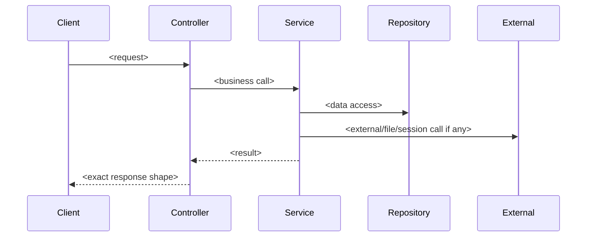

# Endpoint Contract: <METHOD> <URL>

| Field | Value |
|---|---|
| Endpoint ID | |
| Controller | |
| Action | |
| Source file | |
| Auth required | Yes/No |
| Authorization rule | |
| Verification | DISCOVERED / CODE_VERIFIED / RUNTIME_VERIFIED / TEST_VERIFIED / UNKNOWN |
| Analysis status | COMPLETE / PARTIAL / BLOCKED |
| Static evidence path | |
| Runtime evidence path | |
| Test asset path | |
| Missing evidence | |

## Source Trace

| Layer | File | Lines | Finding |
|---|---|---:|---|
| Controller/action | | | |
| Service/helper | | | |
| Repository/query | | | |
| DTO/model/projection | | | |
| Serializer/config | | | |

Do not leave this section empty for P0/P1 endpoints. Endpoint scanning tools are not sufficient evidence.

## Business Sequence

Replace the placeholder sequence with the actual endpoint flow. If the flow cannot be traced, mark the contract `BLOCKED`.

## Request

| Parameter | Source | Type | Required | Default | Validation | Notes |
|---|---|---|---:|---|---|---|

## Response

| Field | Value |
|---|---|
| Success status | |
| Error status | |
| Content-Type | |
| Response shape | JSON object / escaped JSON string / HTML / file / redirect |
| Evidence source | Runtime capture / Golden Master fixture / Static source only |

Do not fill response fields from DTOs, controller signatures, or guessed serializer behavior as runtime evidence. If runtime evidence is missing, mark this contract `CODE_VERIFIED` and `PARTIAL` or `BLOCKED`.

## Response Schema

| Path | Type | Required | Nullable | Source | Branch/Condition | Notes |
|---|---|---:|---:|---|---|---|
| $.status | integer/string/boolean | | | Literal / computed / legacy wrapper | | |
| $.data | object/array/string/null | | | Service/repository/helper trace | | Must be expanded below; do not leave as generic object |

### Nested `data` Schema

| Path | Type | Required | Nullable | Source | Branch/Condition | Notes |
|---|---|---:|---:|---|---|---|

If any response path remains only `object`, `dynamic`, `anonymous object`, `var`, or unresolved `data`, mark `Analysis status` as `BLOCKED` and list the missing evidence.

## JSON Rules

| Rule | Legacy behavior | Target requirement |
|---|---|---|
| Casing | | |
| Null behavior | | |
| DateTime | | |
| Enum | | |
| Numeric | | |

## Headers/Cookies/Redirects

| Name | Behavior |
|---|---|

## Session

| Key | Read/Write | Type | TTL | Notes |
|---|---|---|---|---|

## Side Effects

| Type | Behavior |
|---|---|
| Database | |
| External API | |
| File | |
| Auth/session | |

## Golden Master Cases

| Test case | Status |
|---|---|

## Post-Migration Findings

Record latent bugs, cleanup opportunities, and optimizations here. Do not fix them during parity migration unless explicitly approved.
