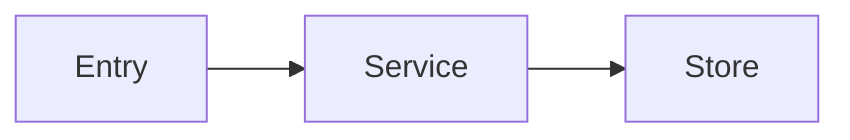

# Developer Handover Final Document Template

Use this topic-focused template for developer documents `01` through `16` under:

```text
.ai/runs/source-code-handover/<run_id>/final/
```

Each document explains only its own system domain. Do not repeat readiness, evidence, limitations, risks, conflicts, or open questions in documents `01` through `16`.

```md
---
document_id: "DOC-NN"
title: "<Vietnamese title>"
run_id: "<run_id>"
source_commit: "<git_sha>"
source_branch: "<branch>"
last_verified_at: "<ISO-8601 timestamp>"
---

# <Tiêu đề tài liệu>

## Mục đích

<Tài liệu này giúp developer làm được gì.>

## Tổng quan

<Mô tả ngắn, trực tiếp về phần hệ thống được trình bày.>

## Thành phần chính

<Bảng module, project, service, API, bảng dữ liệu, job hoặc integration liên quan.>

## Luồng xử lý

<Giải thích entry point, input, xử lý, internal calls, data read/write và output/side effects.>



## Cách chạy và kiểm tra

| Bước | Thư mục | Lệnh/thao tác | Kết quả mong đợi |
|---|---|---|---|
| 1 | `<working-directory>` | `<command>` | `<observable result>` |

## Điểm thường chỉnh sửa

| Nhu cầu | File/module bắt đầu | Thành phần liên quan | Cách kiểm tra |
|---|---|---|---|
| `<change type>` | `<path>` | `<dependency>` | `<test/smoke command>` |

## Mã nguồn liên quan

- `<source path>` - `<symbol or responsibility>`
```

Only keep sections relevant to the document topic. Do not add empty sections or placeholders.

## Mapping Documents `17` Through `20`

- `17_known_risks.md`: centralized risk register only.
- `18_open_questions.md`: centralized open-question register only.
- `19_evidence_index.md`: source/evidence mapping only.
- `20_documentation_coverage.md`: inventory-to-document coverage mapping only.

Topic documents may link to these mapping documents, but must not copy their tables or sections.
