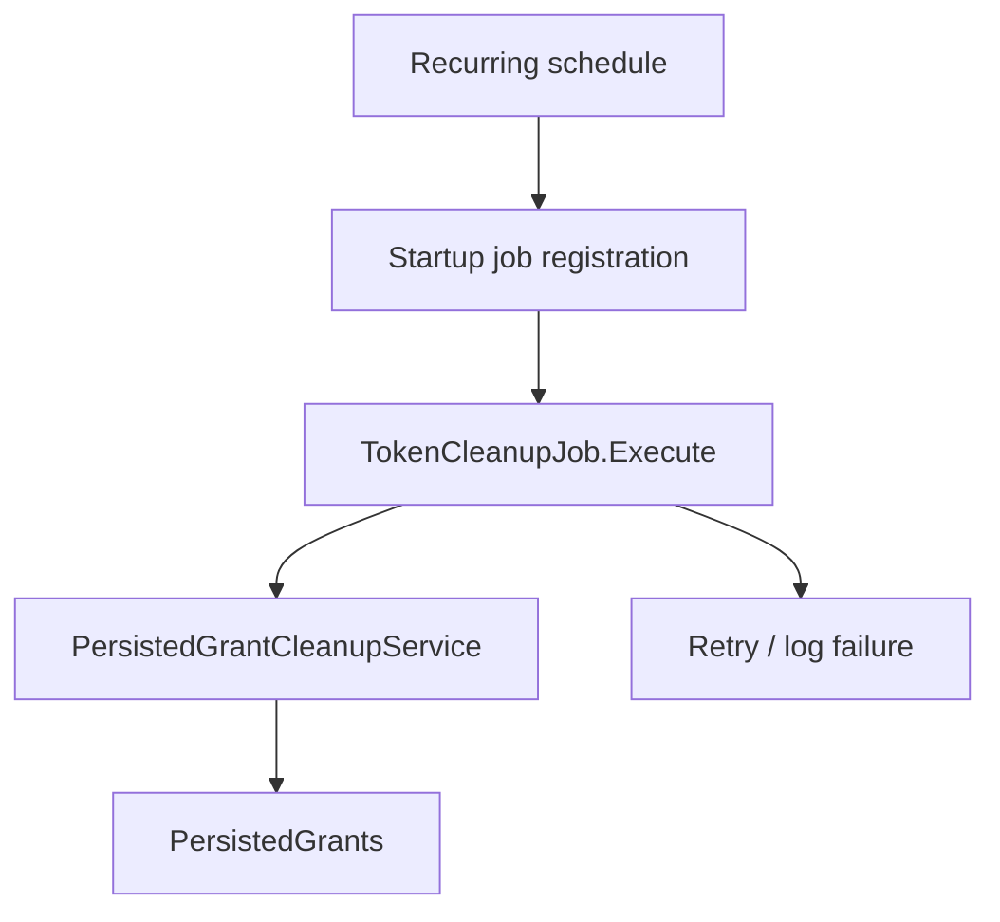
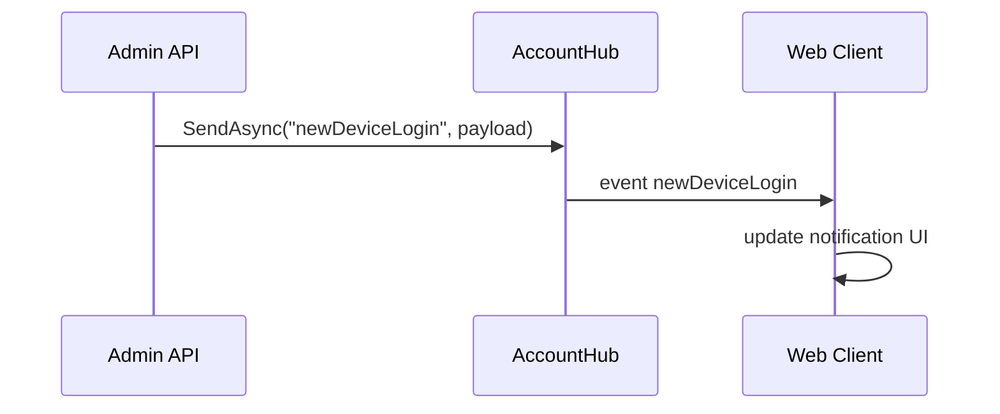

# Source Code Handover Final Document Template

Agent 9 MUST use this template for every final document in:

```text
.ai/runs/source-code-handover/<run_id>/final/
```

Do not remove sections. If a section has no content, write `Không có.` or a valid `[NOT_APPLICABLE]` block with negative evidence.

This template defines the developer-facing final document body. Rendered final documents MUST be written in Vietnamese, while technical identifiers, paths, commands, config keys, API routes, JSON keys, database names, Evidence IDs, code blocks, stack traces, and Mermaid syntax keywords remain unchanged.

Final documents MUST cite verified `EV-*` IDs only. `DISC-*` discovery IDs from Agent 1-5 are forbidden in final docs. Discovery gaps must be represented through Agents 6-8 verified `EV-NEG-*`, `[UNVERIFIED]`, `[CONFLICT]`, or `[BLOCKED]` evidence.

```md
---
document_id: "DOC-NN"
title: "<Vietnamese title>"
run_id: "<run_id>"
source_commit: "<git_sha>"
source_branch: "<branch>"
status: "Ready | Partial | Blocked | Not Applicable"
primary_owner_agent: "agent-XX"
evidence_ids:
  - "EV-XXX-001"
last_verified_at: "<ISO-8601 timestamp>"
---

# <Vietnamese document title>

## Phạm vi

| Hạng mục | Nội dung |
|---|---|
| Tài liệu | `<NN_doc_name.md>` |
| Repository | `<repo-name>` |
| Source commit | `<git_sha>` |
| Agent phụ trách chính | `agent-XX` |
| Phạm vi | `<what this document covers>` |
| Ngoài phạm vi | `<what this document does not cover>` |

## Trạng thái

| Mục | Giá trị |
|---|---|
| Readiness | Ready / Partial / Blocked / Not Applicable |
| Lý do | `<short reason>` |
| Coverage liên quan | `<summary from 20_documentation_coverage.md>` |

### Readiness chi tiết

| Dimension | Status | Evidence | Ghi chú |
|---|---|---|---|
| Documentation structure | Ready / Partial / Blocked | EV-XXX-001 | `<structure status>` |
| Source discovery | Complete / Partial / Insufficient | EV-XXX-001 | `<asset-level discovery status>` |
| Evidence quality | Sufficient / Partial / Insufficient | EV-XXX-001 | `<atomic evidence status>` |
| Documentation coverage | Valid / Partial / Invalid Measurement | EV-XXX-001 | `<coverage denominator source>` |
| Local setup readiness | Ready / Blocked / Not Verified | EV-XXX-001 | `<local setup caveat>` |
| Build readiness | Ready / Blocked / Not Verified | EV-TEST-001 | `<build command/result or limitation>` |
| Test readiness | Ready / Blocked / Not Verified | EV-TEST-001 | `<test command/result or limitation>` |
| Runtime readiness | Verified / Not Verified | EV-RT-001 | `<runtime artifact or limitation>` |
| Operations readiness | Ready / Partial / Blocked | EV-OPS-001 | `<ops/runbook status>` |
| Production handover | Ready / Not Ready / Not Verified / Rejected | EV-OPS-001 | `<production handover status>` |

## Nguồn dữ liệu / Evidence

| Evidence ID | Claim | Source path | Line/method | Verification type | Status |
|---|---|---|---|---|---|
| EV-XXX-001 | `<claim>` | `<path>` | `<line/method>` | Source / Config / Runtime / Negative evidence | [CONFIRMED] |

## Nội dung chính

### <Section title>

[CONFIRMED] <Evidence-backed content written for a new developer.>

Evidence:
- EV-XXX-001

<Use tables, cards, runbooks, and diagrams required by `.ai/rules/08-source-code-handover-quality-checklist.md`.>

### Hành vi nghiệp vụ và compatibility

| Hạng mục | Nội dung | Evidence | Trạng thái |
|---|---|---|---|
| Business rule | `<rule summary or BR-ID>` | EV-XXX-001 | [CONFIRMED] / [UNVERIFIED] / [CONFLICT] / [DECISION] |
| Data read/write | `<tables/columns/cache/jobs/external systems>` | EV-XXX-001 | [CONFIRMED] |
| Auth/permission | `<where auth or authorization is checked>` | EV-XXX-001 | [CONFIRMED] |
| Behavior phải giữ | `<migration compatibility requirement>` | EV-XXX-001 | [DECISION] |

### Migration / Rollback Notes

| Behavior / Module | Must not change | Baseline proof | .NET 8 target risk | Rollback plan | Owner | Evidence | Status |
|---|---|---|---|---|---|---|---|
| `<module>` | `<behavior>` | `<test/smoke/data comparison>` | `<risk>` | `<rollback action>` | `<owner>` | EV-XXX-001 | [CONFIRMED] / [UNVERIFIED] / [DECISION] |

## Hạn chế

| Hạn chế | Tác động | Evidence | Trạng thái |
|---|---|---|---|
| `<limitation>` | `<impact>` | EV-XXX-001 | [UNVERIFIED] / [BLOCKED] |

## Câu hỏi mở

Không có.

<!-- Or use this table when questions exist:
| Question ID | Câu hỏi | Tại sao quan trọng | Evidence đã tìm | Suggested owner | Blocking level | Status | Next action |
|---|---|---|---|---|---|---|---|
| Q-XXX-001 | `<question>` | `<impact>` | EV-XXX-001 | `<owner>` | Critical / High / Medium / Low | Open | `<next action>` |
-->

## Rủi ro

Không có rủi ro riêng ngoài các mục đã ghi trong `17_known_risks.md`.

<!-- Or use this table when risks exist:
| Risk ID | Severity | Status | Evidence | Impact | Exploit/failure precondition | Owner | Remediation | Target/next step |
|---|---|---|---|---|---|---|---|---|
| RISK-XXX-001 | High | [CONFIRMED] | EV-XXX-001 | `<impact>` | `<precondition>` | `<owner>` | `<remediation>` | `<next step>` |
-->
```

## Pass Criteria

- Front matter is complete and `document_id` matches the filename number.
- The seven common sections exist in order.
- Required document-specific tables/cards/diagrams from the checklist are present.
- No example value remains.
- Every Evidence ID exists in `19_evidence_index.md` and `evidence/evidence-manifest.json`.
- No `DISC-*` discovery ID is used as final proof.
- Missing components use negative evidence, not vague prose.
- `Ready` is not used for build/test/runtime/ops unless supported by Agent 8 evidence.
- The document contains behavior-level content, not only headings or template filler.

## Mini Examples

Good final claim:

```md
[CONFIRMED] API `POST /quiz-submit` được implement bởi `QuizSubmitController.Submit`,
gọi service `QuizSubmitService.Submit`, ghi bảng `QuizResponses`, và cập nhật ranking cache
khi cache service được gọi.

Evidence:
- EV-API-014
- EV-DB-031
- EV-OPS-018
```

Bad final claim:

```md
[CONFIRMED] Module Quiz Submit xử lý nộp bài.
Evidence:
- DISC-API-014
```

Reject the bad claim because it is generic, cites `DISC-*`, and does not describe route, actor, data write, cache/job/external side effects, or verified evidence.

### Anti-Skeleton Examples

Use these as calibration examples. Replace every route, class, table, key, command, and Evidence ID with current-run evidence.

Good local setup command block:

```md
| Step | Prerequisites | Working directory | Command | Expected | Smoke/verification | Evidence | Status |
|---|---|---|---|---|---|---|---|
| Build API | `.NET SDK 8.0.302`, restored NuGet feeds | repo root | `dotnet build Project.sln` | exit `0` | build log has no errors | EV-TEST-003 | [CONFIRMED] |
| Run API | local SQL connection configured | `src/Web` | `dotnet run --urls http://localhost:5000` | listens on port `5000` | `GET /health` returns `200` | EV-RT-001, EV-RT-002 | [CONFIRMED] |
```

Bad local setup:

```md
Run `dotnet build`.
```

Reject because it has no prerequisites, working directory, expected result, smoke check, config/database notes, or troubleshooting.

Good asset-level coverage:

```md
| Domain | Discovery source | Discovered | Documented | Unresolved | N/A | Excluded | Accounted | Status | Gaps |
|---|---|---:|---:|---:|---:|---:|---:|---|---|
| API actions/routes | `inventory/routes.json` | 86 | 79 | 7 | 0 | 0 | 86 | PARTIAL | `18_open_questions.md#q-api-003` |
| DbContexts | `inventory/dbcontexts.json` | 6 | 6 | 0 | 0 | 0 | 6 | PASS | None |
```

Bad category-level coverage:

```md
| Domain | Discovered | Documented | Status |
|---|---:|---:|---|
| API | 1 | 1 | PASS |
| DbContext | 1 | 1 | PASS |
```

Reject because broad domains must count physical source assets, not headings.

Good API contract row:

```md
| API ID | Route | Method | Module | Auth | Permission | Content type | Request model | Success response | Error response | DB side effects | Redis/jobs/external side effects | Evidence | Status |
|---|---|---|---|---|---|---|---|---|---|---|---|---|---|
| API-ACCT-001 | `/accounts` | POST | Accounts | Bearer token | `Accounts.Create` | `application/json` | `CreateAccountRequest` | `200`, `{ success, data: id }` | `ModelState` validation errors | inserts `Accounts`, writes audit log | invalidates `account:*` | EV-API-021, EV-AUTH-012, EV-DB-044, EV-OPS-009 | [CONFIRMED] |
```

Good request/response field detail:

```md
| API ID | Field location | Field | Type | Required | Validation/default | Source DTO/model | Evidence | Status |
|---|---|---|---|---|---|---|---|---|
| API-ACCT-001 | request body | `username` | `string` | yes | required, unique per `channel_id` | `CreateAccountRequest` | EV-API-022, EV-DB-044 | [CONFIRMED] |
| API-ACCT-001 | response body | `data` | `int` | yes | created account ID | `ActionResponse<int>` | EV-API-023 | [CONFIRMED] |
```

Bad API catalog row:

```md
| `/accounts` | POST | Create account |
```

Reject because it cannot answer auth, validation, response contract, data writes, cache/job side effects, or evidence.

Good database field dictionary:

```md
| DbContext | Source path | Project | Registration point | Connection string key | Migration assembly | Database | Evidence | Status |
|---|---|---|---|---|---|---|---|---|
| `ConfigurationDbContext` | `src/Identity/ConfigurationDbContext.cs` | `Admin.EntityFramework` | `Startup.ConfigureServices` | `ConfigurationDbConnection` | `Admin.EntityFramework` | `IdentityServer4Admin` | EV-DB-001, EV-CONFIG-004 | [CONFIRMED] |

| Entity | Table/schema | Columns documented | PK | FK/relationships | Used by APIs/jobs | Mapping source | Evidence | Status |
|---|---|---:|---|---|---|---|---|---|
| `Client` | `Clients` | 18/18 | `Id` | `ClientScopes`, `ClientSecrets`, `ClientClaims` | `/Clients` management APIs | Fluent API + migrations | EV-DB-021, EV-MIGRATION-004, EV-API-033 | [CONFIRMED] |

| Table | Column | CLR type | DB type | Nullable | Key/index | Meaning/rule | Read/write path | Evidence | Status |
|---|---|---|---|---|---|---|---|---|---|
| `Clients` | `ClientId` | `string` | `nvarchar(200)` | no | unique index | OAuth client identifier | `ClientsController.Create` -> `ConfigurationDbContext` | EV-DB-022, EV-API-033 | [CONFIRMED] |
```

Bad database detail:

```md
Database uses `IdentityServer4Admin` and table `Clients`.
```

Reject because it does not list DbContexts, DbSets, entities, columns, keys, relationships, migrations, consumers, or coverage.

Good background job flow:

````md
| Job | Registration | Trigger | Handler | Storage/queue | Side effects | Retry/failure | Evidence | Status |
|---|---|---|---|---|---|---|---|---|
| Token cleanup | `Startup.ConfigureServices` | recurring schedule | `TokenCleanupJob.Execute` | Hangfire storage | deletes expired persisted grants | retry/logging from Hangfire config | EV-JOB-001, EV-DB-050, EV-OPS-012 | [CONFIRMED] |


````

Bad background job detail:

```md
Project has `BackgroundService`.
```

Reject because it lacks registration, trigger, handler, side effects, retry/failure path, and diagram.

Good realtime flow:

````md
| Event | Direction | Producer | Hub/socket | Consumer | Payload fields | Group/user mapping | Auth | Evidence | Status |
|---|---|---|---|---|---|---|---|---|---|
| `newDeviceLogin` | server -> client | `SignalController.SendNewDeviceLogin` | `AccountHub` | web SignalR client | `userId`, `device`, `time` | group from account/user ID | hub policy | EV-RT-011, EV-API-066 | [CONFIRMED] |


````

Bad realtime detail:

```md
SignalR sends notifications.
```

Reject because it lacks hub route, producer, consumer, event name, payload, group/user mapping, auth, failure behavior, and diagram.

Good operations incident card:

```md
| Field | Value |
|---|---|
| Incident | API cannot issue tokens |
| Health | `GET /health`, `GET /.well-known/openid-configuration` |
| Log | container logs for API service; application log path from config |
| Rollback | redeploy previous image tag; do not roll back database unless migration rollback evidence exists |
| Escalation | Auth owner and DevOps owner |
| Evidence | EV-RT-002, EV-OPS-014, EV-CONFIG-009 |
```

Bad runbook:

```md
Restart service when error happens.
```

Reject because it is not actionable.
